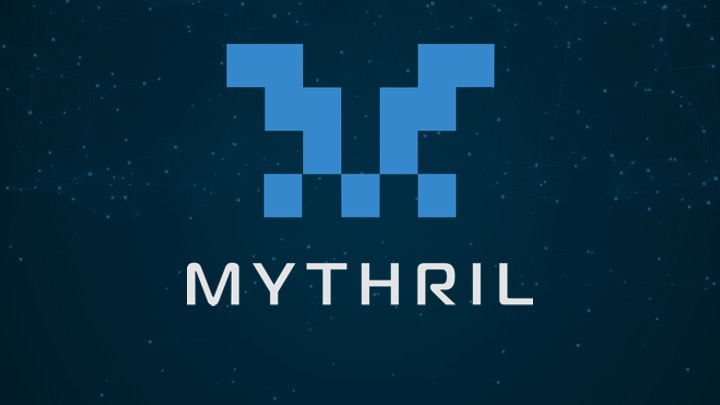

# 스마트 컨트랙트 퍼징과 분석 도구

### 이재영(Finder)

### 목차
- 스마트 컨트랙트 보안의 중요성
- 스마트 컨트랙트에서 취약점을 찾는 방법
- 정적 분석도구
    - Slither
    - Aderyn
- 스마트 컨트랙트 퍼저
    - Echidna
    - Medusa
- 심볼릭 실행
    - Mythril
- 통합 도구
    - MythX
- 스마트컨트랙트 퍼징의 한계점
- 마무리

## 스마트 컨트랙트 보안의 중요성

스마트 컨트랙트는 블록체인 생태계에서 매우 중요한 역할을 합니다.
중개자의 개입 없이 거래를 자동으로 실행할 수 있으며, 모든 기록은 블록체인에 저장되어 투명성과 변경 불가능성을 보장합니다.

하지만 스마트 컨트랙트는 한 번 배포되면 수정이 어렵고, 메인넷에서 실행된 트랜잭션은 되돌릴 수 없습니다.
따라서 간단한 로직 버그나 보안 취약점이 있는 상태로 배포될 경우, 즉시 수억 원에서 수십억 원에 이르는 피해가 발생할 수 있습니다.

특히 블록체인은 탈중앙화된 시스템이기 때문에, 실수나 해킹이 발생하더라도 이를 되돌릴 수 있는 중앙 기관이나 관리자가 존재하지 않습니다.

또한 중앙화된 금융시스템과 달리 누군가가 자산을 대신 회수해 주거나 되돌려주는 구조가 아니기에 처음부터 보안 취약점이 없는 스마트컨트랙트 배포해야 합니다.

## 스마트 컨트랙트에서 취약점을 찾는 방법

스마트컨트랙트에서 취약점을 찾는 방식은 다양하지만 여기서는 대표적으로 Formal Verification, Symbolic Execution, Fuzzing, Intermediate Representation 4가지만 설명하겠습니다

먼저 Formal Verification은 코드에 포함된 조건들이 모든 상황에서 항상 만족하는지 수학적으로 검증하는 방식입니다. 예를 들어 자금을 예치하고 4일 뒤에 예치금을 출금할 수 있을 때 어떤 입력값이 들어와도 항상 맞게 동작하는지 수학적으로 검증하는 방식입니다

대표적인 도구로는 [**Certora Prover**](https://www.certora.com/prover)가 있습니다.

이 툴은 컨트랙트에 대한 규칙을 작성하고 해당 규칙이 코드 전체에 대해 항상 성립하는지를 SMT 기반으로 증명해 줍니다.

두 번째는 Symbolic Execution방식입니다 symbolic Execution은 입력값을 실제 값이 아닌 심볼로 두고 프로그램을 실행시켜 경로를 탐색하며 어떤 상태변화가 발생하는지 추적하는 방식입니다. 예를 들어 `msg.sender == owner` 라는 조건이 있을 때 이 조건을 만족시키지 않고 자금을 인출할수있는 경로가 있는지 탐색하는 식으로 취약점을 찾습니다

## 정적 분석도구

스마트컨트랙트의 취약점을 분석할 때 퍼징과 함께 자주 사용되는 것이 정적분석도구입니다.

정적 분석은 코드를 실제로 실행하지 않고 소스코드 또는 바이트코드 상의 구조와 흐름을 분석해서 취약점을 탐지하는 방법입니다. 대표적인 정적 분석 도구로는 Slither, Aderyn, Solhint 등이 있습니다.

## Slither

[slither](https://github.com/crytic/slither)는 Crytic에서 개발한 Solidity 정적 분석 프레임워크입니다 Solidity 코드를 분석해 다양한 취약점 패턴을 탐지하고 함수 호출 그래프, 변수 의존성, 제어 흐름 등을 시각화하거나 JSON 형식으로 출력할 수 있습니다

Slither는 재진입공격과 잘못된 접근제어 상태 변수 관련 취약점들을 주로 찾는데 설계되어 있습니다

### Aderyn

[Aderyn](https://github.com/Cyfrin/aderyn)은 Cyfrin에서 개발한 Rust 기반 Solidity 정적 분석 도구입니다. Aderyn은 Solidity 스마트 컨트랙트의 소스코드를 분석하여 추상 구문 트리(AST)를 순회하며 잠재적인 보안 취약점을 탐지합니다.

Aderyn은 코드를 실제로 실행하지 않고 정적으로 분석하여 재진입 공격, 잘못된 접근 제어, 오버플로우/언더플로우 등 다양한 취약점 패턴을 식별할 수 있습니다. 분석 결과는 마크다운 형식의 보고서로 생성되어 개발자가 쉽게 읽고 이해할 수 있습니다.

또한 Foundry, Hardhat 등의 개발 프레임워크와 쉽게 통합되며, 사용자가 특정 프로젝트에 맞는 커스텀 탐지기를 구축할 수 있는 프레임워크를 제공합니다. 최근에는 Language Server Protocol(LSP)을 지원하여 VS Code 등의 에디터에서 실시간으로 보안 진단을 받을 수 있는 기능도 추가되었습니다.

## 스마트컨트랙트 퍼저

스마트컨트랙트 퍼저의 종류는 다양하지만 여기선 대표적인 퍼저 Echidna, Medusa 퍼저를 **** 중심으로 설명하겠습니다.

### Echidna

[Echidna](https://github.com/crytic/echidna)는 crytic에서 개발한 solidity기반 스마트컨트랙트 퍼저입니다.

Echidna는 퍼저에서 생성된 입력값을통해 컨트랙트를 반복해서 실행하면서 property가 어긋나는지

자동으로 탐지하는 기능을 가지고 있고 코드의 논리적으로 보장되어있는 조건이 깨지는 입력값을 생성하는걸 생성하는걸 찾는걸 목표로하는 Property based Fuzzing방식으로 퍼징을 진행합니다

Property based Fuzzing이란 대상 함수가 항상 참이여야할속성을 지정하고 그걸 바탕으로

입력값을 생성하는 fuzzing기법중 하나입니다.

### Medusa

[Medusa](https://github.com/crytic/medusa)또한  crytic에서 개발한 cross-platform go-ethereum 기반 스마트컨트랙트 퍼저입니다.

Medusa는 CLI 또는 Go API통해 병렬으로 퍼징이 가능합니다. Medusa는 커버리지를 증가시키는 호출 시퀸스만 코퍼스에 저장하고 이를통해 입력을 생성해서 퍼징을 진행합니다. 또한 assert문이나 solidity에서 정의한 조건 함수를 통해 Assertion 및 Property 테스트도 지원합니다 그리고 퍼징중 발생하는 다양한 이벤트에 low level에서 hook을 걸 수 있게 하며 고수준 api는 현재 구현 중이라고 합니다.

## 심볼릭 실행

### Mythril

[mythril](https://github.com/ConsenSysDiligence/mythril)는 ConsenSys Diligence에서 개발한 EVM 스마트컨트랙트 보안 분석 도구입니다

Symbolic Execution을 통해서 제약 조건 해결을 기반으로 작동하며 solidity로 작성된 스마트컨트랙트나 EVM 바이트코드를 분석해서 취약점을 자동으로 탐지한다. 그리고 재진입공격 , 잘못된 접근 제어, selfdestruct등 다양한 취약점을 탐지할수있으며 공격할 수 있는 트랜젝션까지 생성해줄수있습니다

## 통합 도구

### MythX

[mythx](https://mythx.io/) Solidity 스마트컨트랙트를 위한 보안 분석툴입니다 MythX는 정적 분석, 퍼징 , 심볼릭 실행 등을 결합한 클라우드 기반 보안 분석 엔진입니다

또한 MythX로 잠재적인 취약점을 탐지하면 분석결과를 보고서를 보내줍니다.

## 스마트컨트랙트 분석 도구의 한계점

스마트컨트랙트를 퍼징할땐 몇 가지 생각해야 할 점이 있습니다.

첫 번째론 재진입, 오버플로우, 언더플로우 같은 흔한 취약점은 시그니처나 탐지 규칙이 정형화되어 있어 잘 잡아내지만 토큰 이코노미 설계 오류, 인센티브 메커니즘의 잘못된 보상 로직처럼 고유한 취약점은 패턴으로 정형화되어 있지 않아 탐지가 어렵습니다.

그다음으론 퍼저는 함수 호출 시퀀스와 입력값 변형을 탐색을 하기때문에 오라클이나 플래시론에서 터지는 취약점같이 외부와 상호작용하는경우를 시뮬레이션 하지못해 취약점을 놓치는 경우가 많습니다

마지막으로 프록시 업그레이드 로직은 실제 로직 컨트랙트와 저장소 컨트랙트를 분리하고, 모든 호출을 delegatecall을 사용하기 때문에 퍼저가 어떤 로직 컨트랙트를 언제 호출할지 스스로 추론하기 어려워 호출 흐름을 완전 탐색하기 힘들어 커버리지가 낮아질수있습니다.

## 마무리

스마트컨트랙트 퍼징은 배포나 오딧 전 1차 검증 수단으로 활용하기에 매우 효과적입니다. 하지만 비즈니스 로직 결함이나 외부 의존성은 단순 퍼징만으로 잡기 어려워 보완이 필요합니다. Echidna, Medusa 등 퍼저마다 탐지 특성이 다르므로 프로젝트 특성에 맞춰 적절히 선택해야 합니다.

Slither, Aderyn 같은 정적분석 도구와 Mythril 같은 심볼릭 실행 도구, 그리고 MythX 같은 통합 플랫폼을 병행하면 퍼징으로 놓치는 경로와 패턴을 효과적으로 보완할 수 있습니다. 따라서 다양한 스마트컨트랙트 분석 도구와 오딧을 병행하며 진행한다면 스마트컨트랙트 해킹 피해를 줄일 수 있는 좋은 방법이 될 수 있습니다.